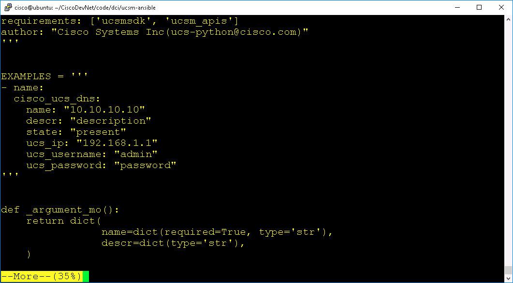
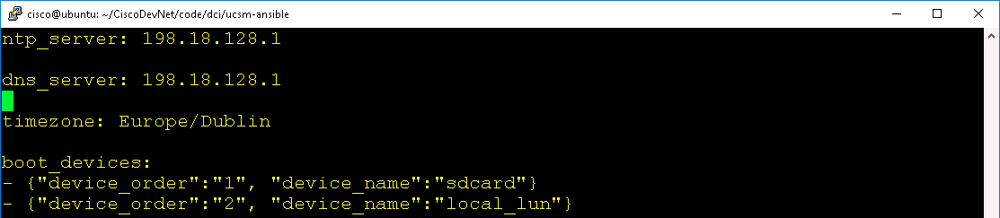
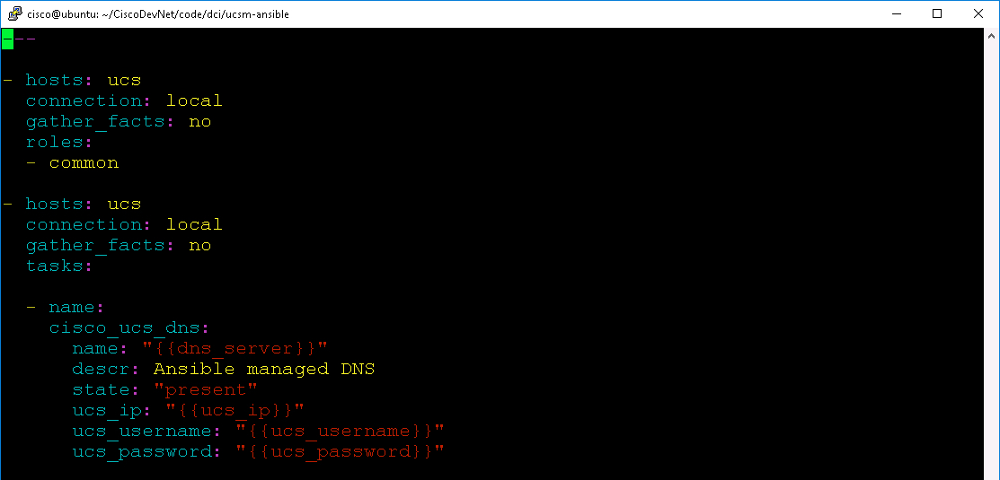
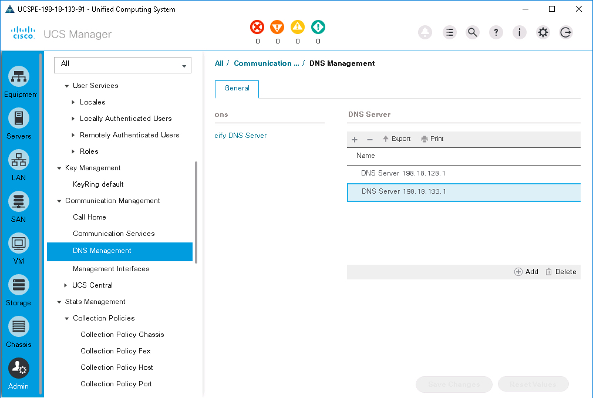

# Mission: DevOps Compute Farm Management with Ansible

### Exercise 1 - Solution

1. Get the UCS Ansible DNS module usage, ensure you are in the `ucsm-ansible/library` directory

  - From the `ucsm-ansible` directory
    `cd library`

  - View the file `cisco_ucs_dns.py`
    - `more cisco_ucs_dns.py`

  <br/><br/>

  <br/><br/>-->

2. Copy the usage information

  ```yaml
    - name:
      cisco_ucs_dns:
        name: "10.10.10.10"
        descr: "description"
        state: "present"
        ucs_ip: "192.168.1.1"
        ucs_username: "admin"
        ucs_password: "password"
  ```

3. Update `group_vars/all`

  - Move up to the `ucsm-ansible` directory
    - `cd ..`
  - Edit the `group_vars/all` file
    - `vi group_vars/all`
  - Add this line
    - `dns_server: 198.18.128.1`

  <br/><br/>

  <br/><br/>-->

4. Update `site.yml`

  - Edit `site.yml`
    - `vi site.yml`
  - Add the lines copied from `cisco_ucs_dns.py` making edits for the variables from `group_vars/all`

  ```yaml
    - name:
      cisco_ucs_dns:
        name: "{{dns_server}}"
        descr: Ansible managed DNS
        state: present
        ucs_ip: "{{ucs_ip}}"
        ucs_username: "{{ucs_username}}"
        ucs_password: "{{ucs_password}}"
  ```

  <br/><br/>

  <br/><br/>-->

5. Apply the `site.yml` ansible playbook

  - `ansible-playbook -i inventory site.yml`

6. View the change in UCS Manager

  <br/><br/>

  <br/><br/>-->

### Exercise 2

Delete the UCS DNS Server

1. Update `site.yml` with the appropriate ansible notation to delete a DNS server to UCS Manager

2. Apply the `site.yml` ansible playbook

3. View the change in UCS Manager

Go to the next page for the solution...
