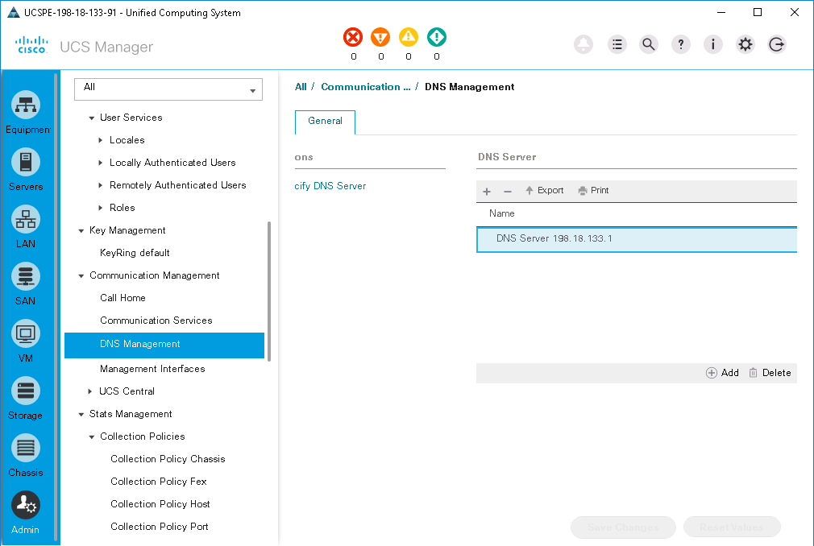
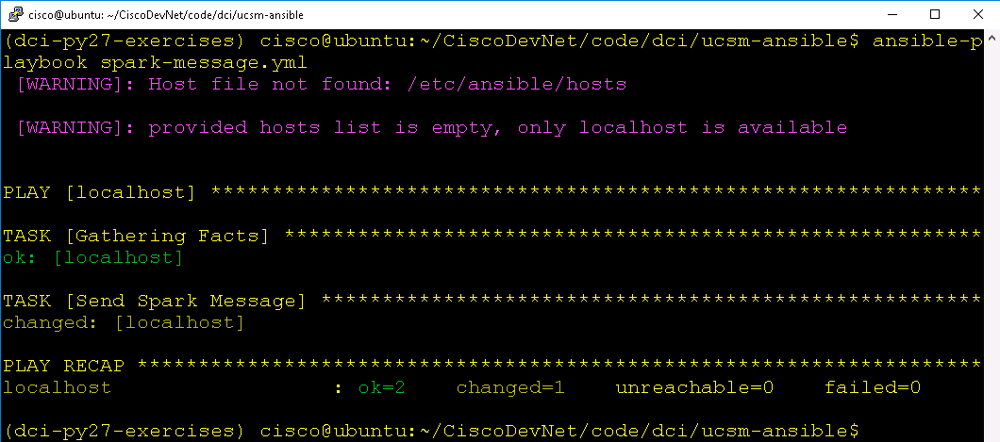

# Mission: DevOps Compute Farm Management with Ansible

### Exercise 2 - Solution

1. Update `site.yml`

  - Edit `site.yml`
    - `vi site.yml`
  - Change the `state` from present to `absent`

  ```yaml
    - name:
      cisco_ucs_dns:
        name: "{{dns_server}}"
        descr: "Ansible managed DNS"
        state: "absent"
        ucs_ip: "{{ucs_ip}}"
        ucs_username: "{{ucs_username}}"
        ucs_password: "{{ucs_password}}"
  ```

2. Apply the `site.yml` ansible playbook

  - `ansible-playbook -i inventory site.yml`

3. View the change in UCS Manager

  <br/><br/>

  <br/><br/>-->

### Mission Completion

Update the **Event Spark Room** with a ***Completion Message***

1. Retrieve your Spark API Access Token. This token is your permanent developer token and is used to access Spark APIs.

  - Login to [Spark Developer Website](https://developer.ciscospark.com/)
  - ***Click*** on your profile image
  - ***Click*** **Copy** to copy your access token to the clipboard<br/><br/>

  <br/><br/>

  <br/><br/>-->

2. Copy the python program `SendSparkMessage.py` from the code directory for the LM-5401 module `Programming Cisco Compute`

  - ` cp ../LM-5401\ -\ programming\ cisco\ compute/SendSparkMessage.py .`

3. Edit `SendSparkMessage.py` and update these variables

  - spark_api_token = 'YOUR TOKEN'
  - spark_room_name = 'YOUR EVENT ROOM NAME'
  - spark_message = 'YOUR MESSAGE'

4. Create an Ansible playbook to execute the Python command to run `SendSparkMessage.py`

  - `vi spark-message.yml`

  - Add these lines

  ```yaml
  ---

  - hosts: localhost
    tasks:

    - name: Send Spark Message
      shell: python SendSparkMessage.py
  ```

5. Apply the `spark-message.yml` ansible playbook

  - `ansible-playbook -i inventory site.yml`

  <br/><br/>

  <br/><br/>-->

  <br/><br/>

  <br/><br/>-->

Congratulations you have completed the Mission for DevOps Compute Farm Management with Ansible.
