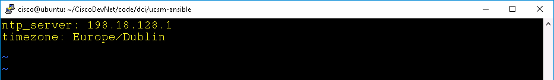

# Managing Cisco Compute with Ansible

Cisco UCS Python SDK provides Ansible modules for UCS Manager that enable Configuration Management of UCS Unified Fabric. It includes network, server, and storage resources. This lab covers installation of the UCS Ansible modules, and use of UCS Ansible modules to configure various UCS policies.

## Objectives

  - Install UCS Ansible Modules
  - Configure a UCS NTP Server
  - Configure a UCS Timezone
  - Configure a UCS Boot Policy

## Prerequisites

Basic knowledge of UCS Compute, Python, and Ansible would be very helpful. However, this lab guide provides step-by-step procedures. Other than that, a desire to learn is all you need to bring with you.

## Product

Cisco UCS® Manager provides unified, embedded management of all software and hardware components of the Cisco Unified Computing System™ (Cisco UCS) and Cisco HyperFlex™ Systems across multiple chassis and rack servers and thousands of virtual machines. It supports all Cisco UCS product models, including Cisco UCS B-Series Blade Servers and C-Series Rack Servers, Cisco UCS Mini, and Cisco HyperFlex hyperconverged infrastructure, as well as the associated storage resources and networks. Cisco UCS Manager is embedded on a pair of Cisco UCS 6300 or 6200 Series Fabric Interconnects using a clustered, active-standby configuration for high availability. The manager participates in server provisioning, device discovery, inventory, configuration, diagnostics, monitoring, fault detection, auditing, and statistics collection.

 Ansible is an agentless configuration management or orchestration tool. Users have the flexibility to turn their laptops into an Ansible control station to automate basic tasks. Or users can deploy a dedicated host to use Ansible as an orchestration tool to rollout application updates while ensuring minimal downtime. Ansible provides a simple domain specific language (DSL) to enable these different use cases.

# Step 1

Install and test Cisco UCS Ansible modules in your lab environment on the Ubuntu host.


**Note:** The screen captures in this lab are from a Putty session launched from the Windows Desktop. Completing this lab from a **Terminal for Coding** session launched on the Ubuntu desktop will follow the same steps.

### Exercise 1

  1. Start a terminal session on the Ubuntu host:

    - Use Putty from Windows desktop.
      - **ip address** - `198.18.134.28`
      - **login as:**  - `cisco`
      - **password**   - `C1sco12345`

    - Choose Python **Virtual** Environment (`venv`) **2** for Python2.

    <br/><br/>

    <!--<br/><br/>-->

    <br/><br/>

    <!--<br/><br/>-->

  2. Install UCS Ansible Modules:

    - You will need the latest UCS Python SDK.

      - `sudo pip install ucsmsdk`
        - sudo password - `C1sco12345`

    - You will need the latest ucsm_apis.

      - `git clone https://github.com/ciscoucs/ucsm_apis`
      - `cd ucsm_apis`
      - `sudo make install`
        - sudo password - `C1sco12345`

    - You will need the latest ucsm-ansible.

      - `cd ..` to move back up a directory
      - `git clone https://github.com/ciscoucs/ucsm-ansible`
      - `cd ucsm-ansible`
      - `python install.py`

  3. Update the `inventory` file for the UCS Manager in your environment:

    - `vi inventory`
      - **ucs_ip** - `198.18.133.91`
      - **ucs_username** - `admin`
      - **ucs_password** - `C1sco12345`

      <br/><br/>

      <!--<br/><br/>-->

  4. View the UCS Ansible module installation:

  The `site.yml` playbook file by default is setup to ensure the environment is ready to manage UCS Manager environments.

  ```yaml
    ---

    - hosts: ucs
      connection: local
      gather_facts: no
      roles:
      - common
  ```

  The `roles/common/tasks/main.yml` playbook file includes `roles/common/tasks/install.yml` playbook. The `install.yml` playbook ensures that all the components required for UCS Ansible modules to function are present.

  For example this **section** of `install.yml` ensures that the UCS Python SDK `ucsmsdk` is installed:

  ```yaml

    - name: check if ucsmsdk is installed
       shell: python -c "import ucsmsdk"
       register: output
       ignore_errors: yes
       changed_when: False

    - name: install ucsmsdk
       pip:
         name: ucsmsdk
       when: output.rc != 0
  ```


  5. Test the the UCS Ansible module installation:

    - `ansible-playbook -i inventory site.yml`

  Your output should be similar to either of theses images. The error in the bottom image indicates that the `ucsmsdk` was not found, and will be installed.

  <br/><br/>

  <!--<br/><br/>-->

  <br/><br/>

  <!--<br/><br/>-->

Next Step: Create UCS configurations with UCS Ansible.
