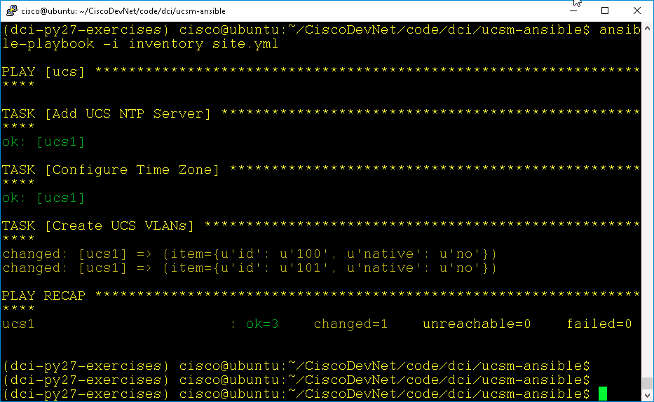

# Managing Cisco Compute with Ansible

# Step 2

Create UCS configurations with UCS Ansible:

  - Set a UCS NTP Server.
  - Set the UCS Timezone.
  - Create a Boot Policy.

### Exercise setup

  In this lab the UCS Ansible calls will be made against a UCS Platform Emulator. You can open the emulator to verify/view the UCS Ansible interactions.

  To launch **UCS Manager** ***double-click*** the UCS Manager icon on the desktop.

  - **Username** — `admin`
  - **Password** — `C1sco12345`

  UCS Manager Desktop Shortcut:

  <br/><br/>

### Exercise 2

Set a UCS NTP Server.

UCS NTP servers are defined in the **Admin** section of UCS Manager in the Timezone Object.

  <br/><br/>

  1. Create the configuration variables file `all` in the `group_vars` directory:

    - From the `ucsm-ansible` directory:
      - `vi group_vars/all` or `nano group_vars/all`
      - Add this line: `ntp_server: 198.18.128.1`
      - Save the file

  2. Add the NTP task to the `site.yml` playbook:

    - `vi site.yml` or `nano site.yml`
    - Add these lines:

  ```yaml
       tasks:
       - name: Add UCS Organization
         ucs_ntp_server:
           hostname: "{{ ucs_hostname }}"
           username: "{{ ucs_username }}"
           password: "{{ ucs_password }}"
           ntp_server: "{{ ntp_server }}"
           state: "{{ ucs_state }}"
  ```

  Notice that the `site.yml` file is using variables for the UCS `hostname`, `username`, `password`, and `state`. Those values are supplied by the `inventory` file.

  Additionally the `site.yml` file is using the `ntp_server` variable that was defined in the `group_vars/all` file.

  <br/><br/>

  3. Run the Ansible playbook:

    - `ansible-playbook -i inventory site.yml`. Your output should be similar to the image below.

      <br/><br/>

    - Check UCS Manager NTP Server, it should be similar to the image below.

      <br/><br/>

### Exercise 3

Set the UCS Timezone.

The UCS Timezone is defined in the **Admin** section of UCS Manager in the Timezone Object.

  1. Update the configuration variables file `all` in the `group_vars` directory:

    - From the `ucsm-ansible` directory:

      - `vi group_vars/all` or `nano group_vars/all`
      - Add this line: `timezone: Europe/Dublin`
      - Save the file

      <br/><br/>

  2. Add the Timezone task to the `site.yml` playbook:

    - `vi site.yml` or `nano site.yml`
    - Add these lines:

  ``` yaml
    - name: Configure Time Zone
      ucs_timezone:
        hostname: "{{ ucs_hostname }}"
        username: "{{ ucs_username }}"
        password: "{{ ucs_password }}"
        admin_state: enabled
        timezone: "{{ timezone }}"
        state: "{{ ucs_state }}"
  ```
      <br/><br/>

  3. Run the Ansible playbook:
    - `ansible-playbook -i inventory site.yml`. Your output should be similar to the image below.

    <br/><br/>

    - Check UCS Manager Timezone it should be similar to the image below.

    <br/><br/>

### Exercise 4

Create and Delete UCS VLANs.

  1. Add the `ucs_vlans` task to the `site.yml` playbook:

    - `vi site.yml` or `nano site.yml`
    - Add these lines:

    ```yaml
    - name: Create UCS VLANs
      ucs_vlans:
        hostname: "{{ ucs_hostname }}"
        username: "{{ ucs_username }}"
        password: "{{ ucs_password }}"
        name: "vlan{{ item.id }}"
        id: "{{ item.id }}"
        native: "{{ item.native }}"
        state: "{{ ucs_state }}"
      loop:
        - { id: '100', native: 'no' }
        - { id: '101', native: 'no' }
    ```

    Using an Ansible `loop` construct the `ucs_vlans` task will add two VLANs.

    <br/><br/>

  2. Run the Ansible playbook:

    - `ansible-playbook -i inventory site.yml`

      Your output should be similar to the image below.

    <br/><br/>

    - Check UCS Manager VLANs in the **LAN** section of UCS Manager in the **VLANs** group it should be similar to the image below.

    <br/><br/>

  Delete UCS VLANs

  3. Edit the `ucs_vlans` task in the `site.yml` playbook:

    - `vi site.yml` or `nano site.yml`
    - change this line:

    ```yaml
        state: "{{ ucs_state }}"
    ```

    - to this:

    ```yaml
        state: "absent"
    ```
      <br/><br/>

  4. Run the Ansible playbook:

    - `ansible-playbook -i inventory site.yml`

    Your output should be similar to the image below.

    <br/><br/>

    - Check UCS Manager VLANs in the **LAN** section of UCS Manager in the **VLANs** group it should be similar to the image below.

    <br/><br/>

Congratulations! You've completed the  ***Managing Cisco Compute with Ansible lab***.
