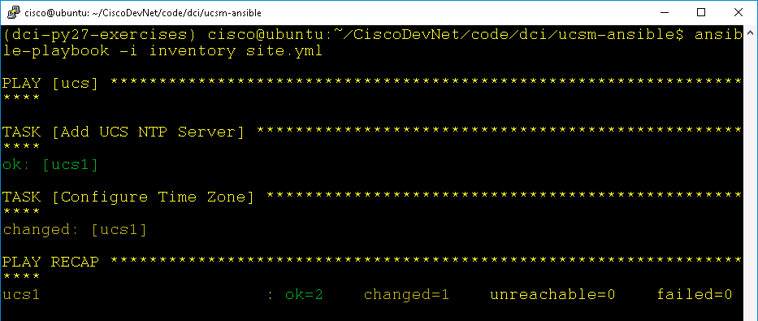
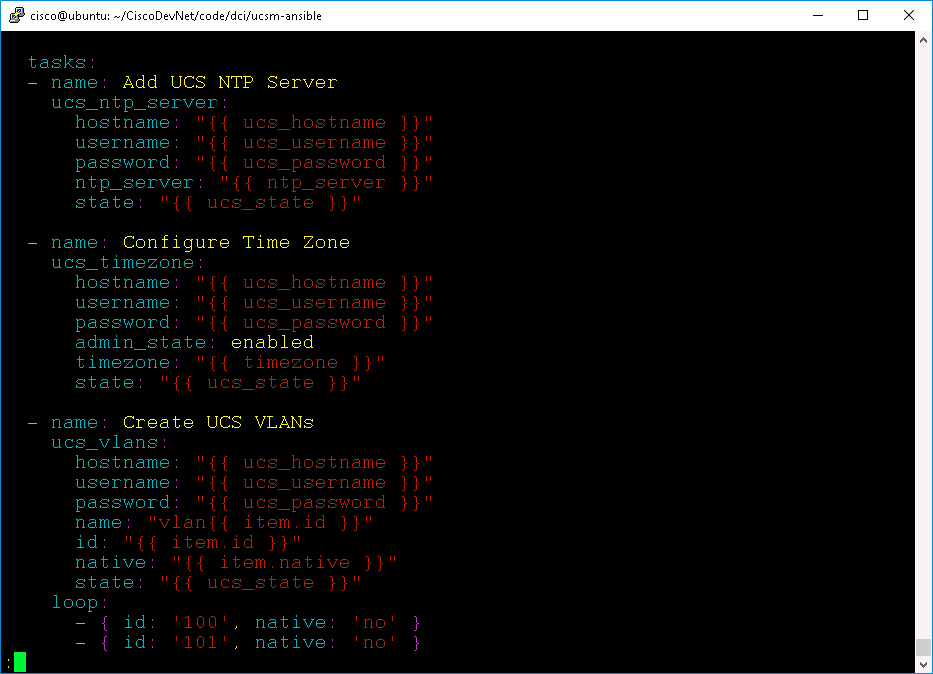

# Managing Cisco Compute with Ansible

# Step 2

Create UCS configurations with UCS Ansible.

  - Set a UCS NTP Server
  - Set the UCS Timezone
  - Create a Boot Policy

### Exercise Setup

  In this lab the UCS XML API calls will be made against a UCS Platform Emulator, you can open the emulator to verify/view the UCS Ansible interactions.

  To launch **UCS Manager** ***double-click*** the UCS Manager icon on the desktop.

    - **Username** - `admin`
    - **Password** - `C1sco12345`

  UCS Manager Desktop Shortcut:

  <br/><br/>

  <br/><br/>-->

### Exercise 2

Set a UCS NTP Server. UCS NTP servers are defined in the **Admin** section of UCS Manager in the Timezone Object.

  <br/><br/>

  <br/><br/>-->

  1. Create the configuration variables file `all` in the `group_vars` directory.

  - From the `ucsm-ansible` directory
    - `mkdir group_vars`
    - `vi group_vars/all`
    - Add this line
      - `ntp_server: 198.18.128.1`
    - Save the file

  2. Add the NTP task to the `site.yml` playbook
    - `vi site.yml`
    - Add these lines

    ```yaml
      - hosts: ucs
        connection: local
        gather_facts: no
        tasks:
        - name: enable ntp
          cisco_ucs_ntp:
            name: "{{ntp_server}}"
            descr: Ansible managed NTP
            state: present
            ucs_ip: "{{ucs_ip}}"
            ucs_username: "{{ucs_username}}"
            ucs_password: "{{ucs_password}}"
    ```

    <br/><br/>

    <br/><br/>-->

  3. Run the Ansible playbook
    - `ansible-playbook -i inventory site.yml`

    Your output should be similar to this image

    <br/><br/>

    <br/><br/>-->

    - Check UCS Manager

    Your output should be similar to this image

    <br/><br/>

    <br/><br/>-->

### Exercise 3

Set the UCS Timezone. The UCS Timezone is defined in the **Admin** section of UCS Manager in the Timezone Object.

  1. Update the configuration variables file `all` in the `group_vars` directory.

  - From the `ucsm-ansible` directory
    - `vi group_vars/all`
    - Add this line
      - `Timezone: Europe/Dublin`
    - Save the file

  2. Add the Timezone task to the `site.yml` playbook
    - `vi site.yml`
    - Add these lines

    ```yaml
      - name:
          cisco_ucs_timezone:
            timezone: "{{timezone}}"
            policy_owner: "local"
            admin_state: "enabled"
            port: "0"
            descr: Ansible managed Timezone
            ucs_ip: "{{ucs_ip}}"
            ucs_username: "{{ucs_username}}"
            ucs_password: "{{ucs_password}}"
    ```

  3. Run the Ansible playbook
    - `ansible-playbook -i inventory site.yml`

    Your output should be similar to the image below, notice that the `cisco_ucs_timezone` task is shown along with the `enable ntp` task.

    <br/><br/>

    <br/><br/>-->

    In the `site.yml` file next to `name:` for the ntp task you added `enable ntp` and that is the name shown in the playbook output. However, for the Timezone task nothing was added after `name:` so the playbook output displays the actual task name.

    - Check UCS Manager

    Your output should be similar to this image

    <br/><br/>

    <br/><br/>-->

### Exercise 4

Create a simple Boot Policy

  1. Update the configuration variables file `all` in the `group_vars` directory.

  - From the `ucsm-ansible` directory
    - `vi group_vars/all`
    - Add these lines
    ```yaml
      boot_devices:
      - {"device_order":"1", "device_name":"sdcard"}
      - {"device_order":"2", "device_name":"local_lun"}
    ```
    - **Note**: There is no indent under `boot_devices`
    - Save the file

    <br/><br/>

    <br/><br/>-->

  2. Add the Boot Policy and Boot Order tasks to the `site.yml` playbook
    - `vi site.yml`
    - Add these lines

    ```yaml
      - name: create boot policy
        cisco_ucs_boot_policy:  
          name: AnsibleBootPol
          ucs_ip: "{{ucs_ip}}"
          ucs_username: "{{ucs_username}}"
          ucs_password: "{{ucs_password}}"
        
      - name: set boot order
        cisco_ucs_boot_order:
          name: AnsibleBootPol
          devices: "{{boot_devices}}"
          ucs_ip: "{{ucs_ip}}"
          ucs_username: "{{ucs_username}}"
          ucs_password: "{{ucs_password}}"
    ```

  3. Run the Ansible playbook
    - `ansible-playbook -i inventory site.yml`

    Your output should be similar to the image below, notice that the `cisco_ucs_boot_policy` and `cisco_ucs_boot_order` tasks are now shown along with the other tasks.

    <br/><br/>

    <br/><br/>-->

    Because a UCS Boot Policy consists of multiple objects, a Boot Policy and a Boot Order. The `Boot Policy` object is created first and then the `Boot Order`  that is part of the policy is added.

    - Check UCS Manager, Boot Policies are in the **Servers** section of UCS Manager in the **Policies** group. In this Exercise the Boot Policy will be place in the ***root*** organization.

    Your output should be similar to this image

    <br/><br/>

    <br/><br/>-->

Congratulations! You've completed the lab *Managing Cisco Compute with Ansible*.
