# Mission: Self-Service Compute Scripts built with PowerShell

### Exercise 1 - Solution

1. At the prompt type:

  ```PowerShell
  Connect-Ucs -Name 198.18.133.91
  ```
    - **Username**: `admin`
    - **password**: `C1sco12345`

  </br>Ucs PowerTool Connect-Ucs:

  <br/><br/>

  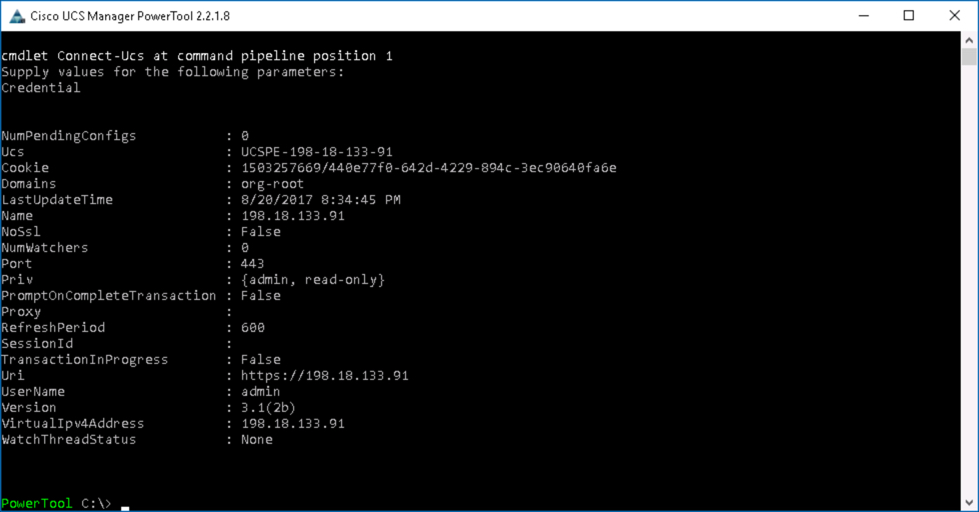<br/><br/>-->

2. Launch UCS Manager by ***double-clicking*** the UCS Manager icon on the Desktop.

  - **Username**: `admin`
  - **Password**: `C1sco12345`

  </br>UCS Manager Icon:

  <br/><br/>

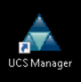<br/><br/>

In the UCS PowerTool Labs you wrote the code to perform an action in UCS Manager, using various methods to determine the UCS Manger Object Name or ClassID to figure out which Cmdlet to use.

Currently there are about 5,250 UCS PowerTool Cmdlets, which might sound a bit daunting. How will you ever find the correct Cmdlet for the desired operation? Fortunately there is a Cmdlet that will help considerably in writing PowerShell scripts that use UCS PowerTool.

`ConvertTo-UcsCmdlet` provides the ability to use the UCS Manager GUI to create UCS PowerTool code. Two methods are covered in this lab.

  - Using UCS PowerTool `Get` Cmdlets to retrieve the current state of an Object and generate the UCS PowerTool code to create that object in the same state.

  - Using UCS Manager GUI log as input to `ConvertTo-UcsCmdlet` to generate the UCS PowerTool Cmdlets that perform the same actions as those captured in the log.

### Exercise 2

Let's start with the first method.

1. Create a Boot Policy in UCS Manager

  - Add a Boot Policy with the Name `LocalBoot_01_PS`
  - Add a `Local Lun` from "Local Devices"
  - Add a `Local CD/DVD` from "Local Devices"

    - ***Right-Click*** "Boot Policies" in the "Policies" Group under the "root" Organization
    - ***Click*** "Create Boot Policy"
    - ***Enter*** "LocalBoot_01_PS" in the *Name* field
    - ***Click*** "Local Devices" to expand the section
    - ***Click*** "Add Local Lun" under "Add Local Disk"
      - ***Select*** "Any"
      - ***Click*** "OK"
    - ***Click*** "Add Local CD/DVD" under "Add CD/DVD"
    - ***Click*** "OK"

  </br>UCS Add Boot Policy:

  <br/><br/>

  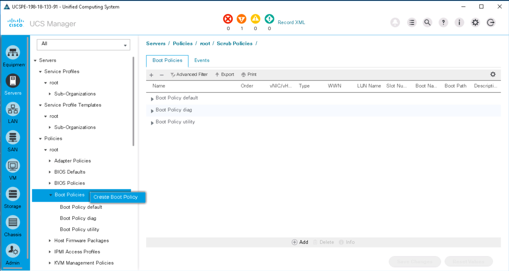<br/><br/>

  <br/><br/>

  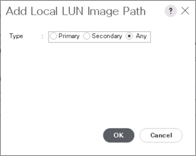<br/><br/>

  <br/><br/>

  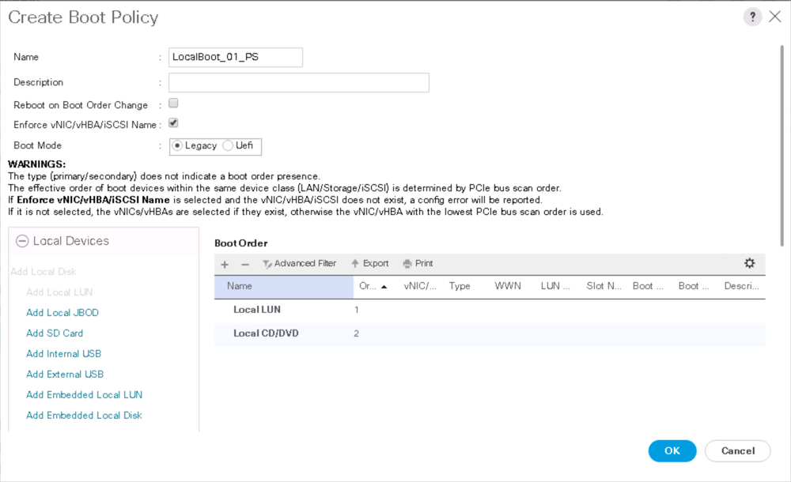<br/><br/>

  <br/><br/>

  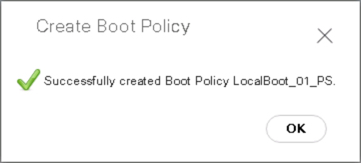<br/><br/>

2. Use UCS PowerTool to retrieve the Boot Policy and generate the UCS PowerTool code that could have been used to create the Boot Policy. Capture the output in a file named `New-BootPolicy.ps1`

  - Change directory to the Desktop
    - `cd C:\users\demouser\Desktop`

  - `Get-UcsBootPolicy -Name LocalBoot_01_PS -Hierarchy | ConvertTo-UcsCmdlet > New-BootPolicy.ps1`

  - The file contents should look like this

  ```JavaScript
  #INFO: Please review the generated cmdlets before deployment.

  Start-UcsTransaction
  $mo = Get-UcsOrg -Level root  | Add-UcsBootPolicy -ModifyPresent  -BootMode "legacy" -Descr "" -EnforceVnicName "yes" -Name "LocalBoot_01_PS" -PolicyOwner "local" -Purpose "operational" -RebootOnUpdate "yes"
  $mo_1 = $mo | Add-UcsLsbootVirtualMedia -ModifyPresent -Access "read-only-local" -LunId "0" -MappingName "" -Order 2
  $mo_2 = $mo | Add-UcsLsbootStorage -ModifyPresent -Order 1
  $mo_2_1 = $mo_2 | Add-UcsLsbootLocalStorage -ModifyPresent
  $mo_2_1_1 = $mo_2_1 | Add-UcsLsbootLocalHddImage -ModifyPresent -Order 1
  Complete-UcsTransaction
  ```

3. Edit the file, `notepad .\New-BootPolicy.ps1` and change
    - `LocalBoot_01_PS` to `LocalBoot_02_PS`
    - `1` to `2`
    - `2` to `1`
  - Save the changes

  </br>Generate PowerTool Code from `Get` Cmdlet:

  <br/><br/>

  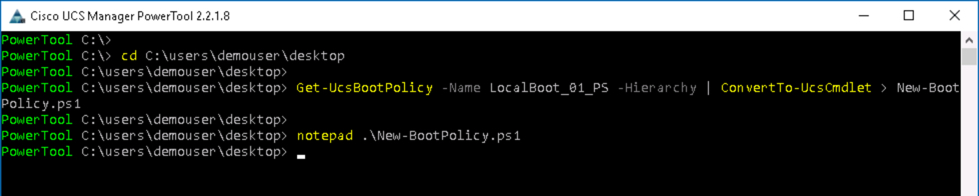<br/><br/>

  </br>Generated PowerTool Code **Before**:

  <br/><br/>

  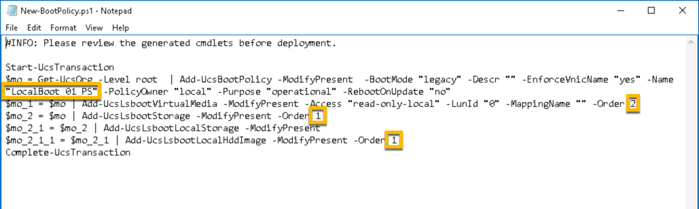<br/><br/>

  </br>Generated PowerTool Code **After**:

  <br/><br/>

  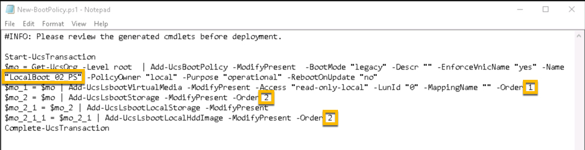<br/><br/>

4. Execute the PowerTool script. View/Compare the two Boot Polices in UCS Manager

  - `.\New-BootPolicy.ps1`

  </br>New-BootPolicy.ps1:

  <br/><br/>

  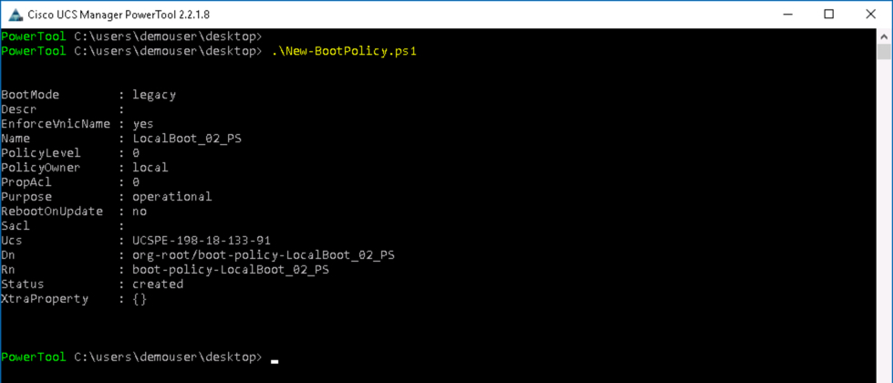<br/><br/>

  </br>UCS Manger Boot Policies:

  <br/><br/>

  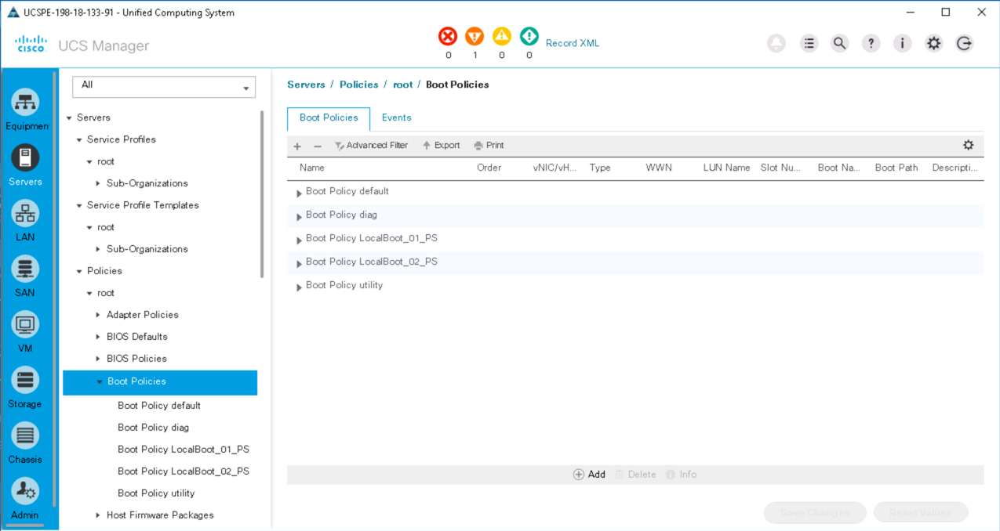<br/><br/>

Go to the next page to try the other code generation method...
