# Mission: Self-Service Compute Scripts built with PowerShell

### Exercise 3

Using the second code creation method, use the UCS API XML captured in the GUI log to generate UCS PowerTool code.

The previous method is good for learning how to recreate existing objects. This next method is a way capture the steps to add (create), set/add (update), remove (delete) objects.

1. Capture UCS Manager XML operations

Due to the access method for the dCloud Pod environments this next step requires the use of the On-Screen Keyboard on the Windows Desktop.

  </br>Windows On-Screen Keyboard:

  <br/><br/>

  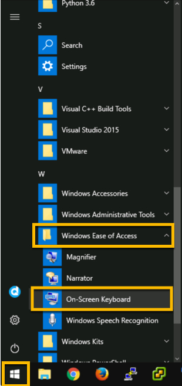<br/><br/>

The UCS Manager GUI Window must be active, ***Clicking*** on the UCS Manager Windows will not cause the On-Screen Keyboard to be pushed to the back.

The UCS Manager GUI Window Title state will indicate if the window is active.

  </br>Active vs. Inactive UCS Manager GUI Window:

  <br/><br/>

  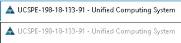<br/><br/>

With the On-Screen Keyboard open in front of the UCS Manager GUI

  - ***Click*** the keys Ctrl + Alt + q

  </br>***Click*** the keys Ctrl + Alt + q:

  <br/><br/>

  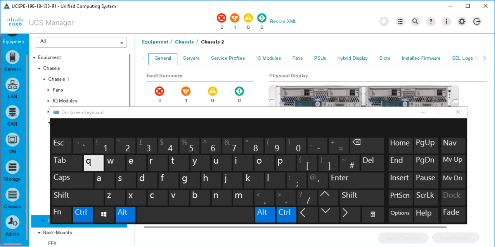<br/><br/>

  - ***Close*** the On-Screen Keyboard

  - ***Click*** the "Record XML" link to start logging. Once clicked the link will change to "Stop XML Recording

  - Perform operations in the GUI
    - ***Add*** a MAC Pool Named - "MAC_POOL_PS"
      - ***Right-Click*** "MAC Pools" in the "Pool" Group under the "root" Organization in the **LAN** Section.
      - ***Click*** "Create MAC Pool"
      - ***Enter*** "MAC_POOL_PS" in the "Name" field
      - ***Click*** "Next"
      - ***Click*** "Add"
      - ***Enter*** "128" in the "Size" field
      - ***Click*** "OK"
      - ***Click*** "Finish"
      - ***Click*** "OK"

    </br>MAC Pool Operations:

    <br/><br/>

    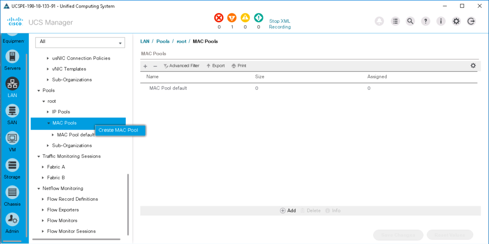<br/><br/>

    <br/><br/>

    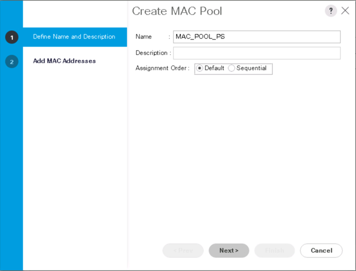<br/><br/>

    <br/><br/>

    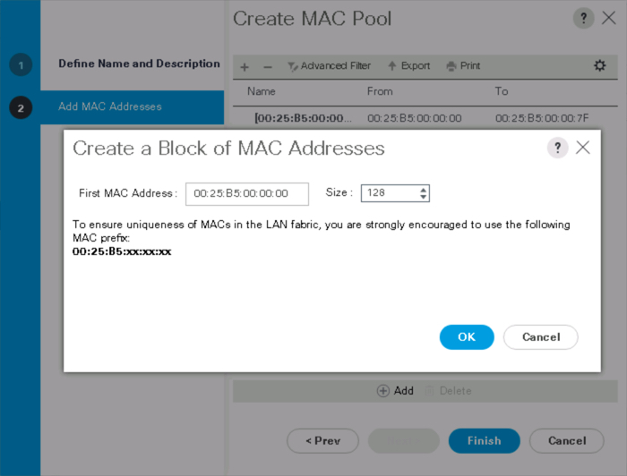<br/><br/>

    <br/><br/>

    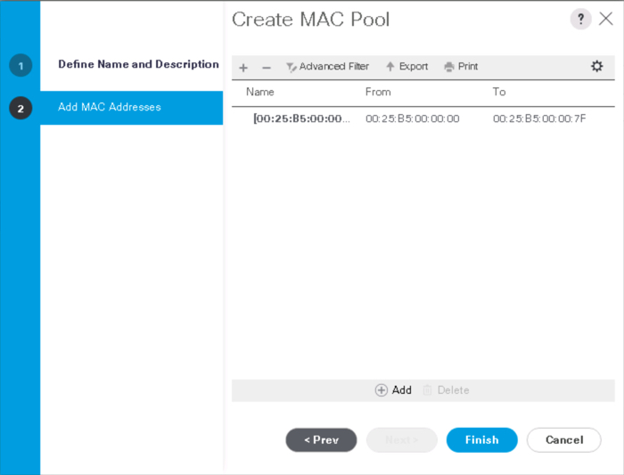<br/><br/>

    <br/><br/>

    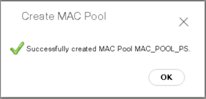<br/><br/>

    - ***Add*** another MAC Block
      - ***Click*** On the MAC Pool
      - ***Click*** On the "MAC Blocks" Tab
      - ***Click*** "Add"
      - ***Change*** "First MAC Address to" - "00:25:B5:00:00:80"
      - ***Enter*** "128" in the "Size" field
      - ***Click*** "OK"
      - ***Click*** "OK"

    <br/><br/>

    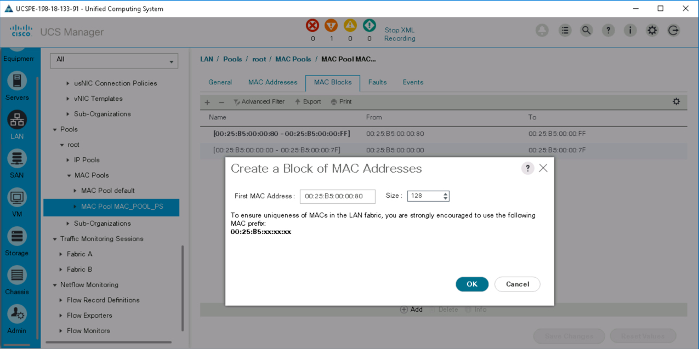<br/><br/>

    <br/><br/>

    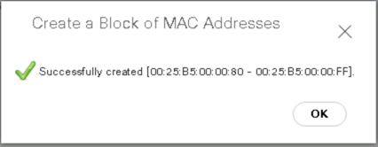<br/><br/>

    - ***Delete*** the MAC Pool
      - ***Right-Click*** on the MAC Pool
      - ***Click*** Delete
      - ***Click*** "Yes"
      - ***Click*** "OK"

    <br/><br/>

    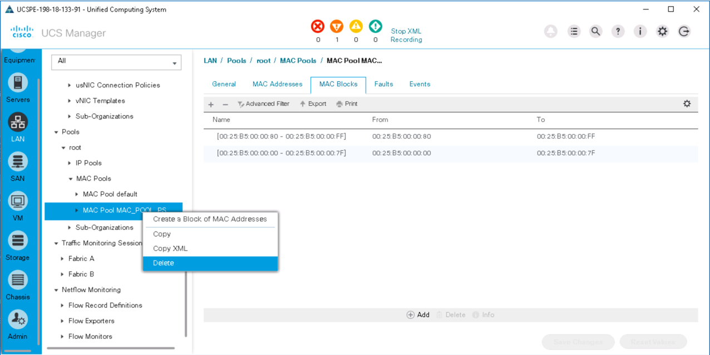<br/><br/>

    <br/><br/>

    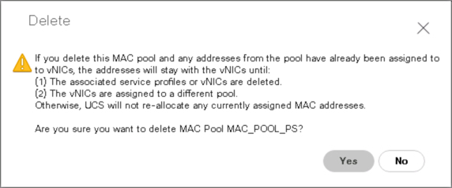<br/><br/>

    <br/><br/>

    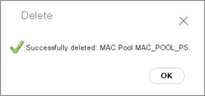<br/><br/>

    - ***Download*** the log file:
      - ***Click*** the "Stop XML Recording" link to stop logging
      - ***Enter*** - MAC_POOL_OPS_PS in the log file name pop-up
      - ***Click*** "OK", the file will download to `C:\users\demouser\Downloads\MAC_POOL_OPS_PS_xmlReq.log`
      - ***Click*** "Save"

    <br/><br/>

    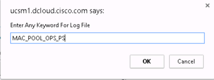<br/><br/>

    <br/><br/>

    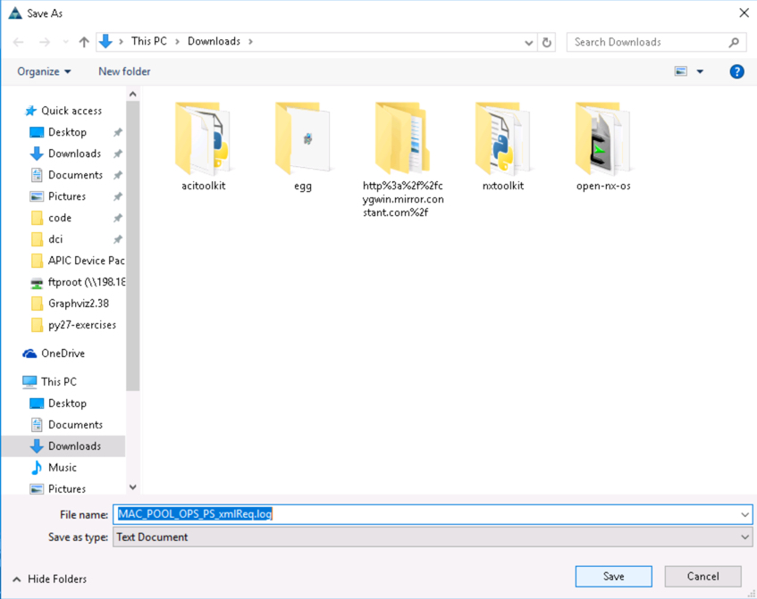<br/><br/>

2. Convert the captured log file to a PowerTool script

  - `ConvertTo-UcsCmdlet -xml -LiteralPath C:\users\demouser\Downloads\MAC_POOL_OPS_PS_xmlReq.log > MAC_POOL_OPS.ps1`

3. Edit the script to add a pause before the delete of the MAC Pool and to `-Force` the MAC Pool Deletion

  - `notepad .\MAC_POOL_OPS.ps1`

  </br>ConvertTo-UcsCmdlet:

  <br/><br/>

  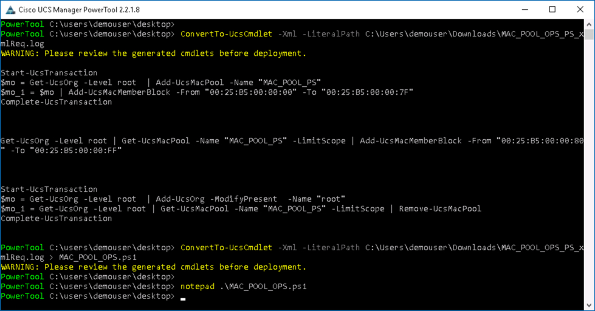<br/><br/>

  - Add the following code, before the MAC Pool Deletion

  ```JavaScript
  Write-Host -NoNewLine "Press any key to continue and Delete MAC Pool. . . "
  [Console]::ReadKey($true) | Out-Null
  ```

  ```JavaScript
  Start-UcsTransaction
  $mo = Get-UcsOrg -Level root  | Add-UcsMacPool -Name "MAC_POOL_PS"
  $mo_1 = $mo | Add-UcsMacMemberBlock -From "00:25:B5:00:00:00" -To "00:25:B5:00:00:7F"
  Complete-UcsTransaction

  Get-UcsOrg -Level root | Get-UcsMacPool -Name "MAC_POOL_PS" -LimitScope | Add-UcsMacMemberBlock -From "00:25:B5:00:00:80" -To "00:25:B5:00:00:FF"

  Write-Host -NoNewLine "Press any key to continue and Delete MAC Pool. . . "
  [Console]::ReadKey($true) | Out-Null

  Start-UcsTransaction
  $mo = Get-UcsOrg -Level root  | Add-UcsOrg -ModifyPresent  -Name "root"
  $mo_1 = Get-UcsOrg -Level root | Get-UcsMacPool -Name "MAC_POOL_PS" -LimitScope | Remove-UcsMacPool -Force
  Complete-UcsTransaction
  ```

  </br>Edit MAC_POOL_OPS.ps1:

  <br/><br/>

  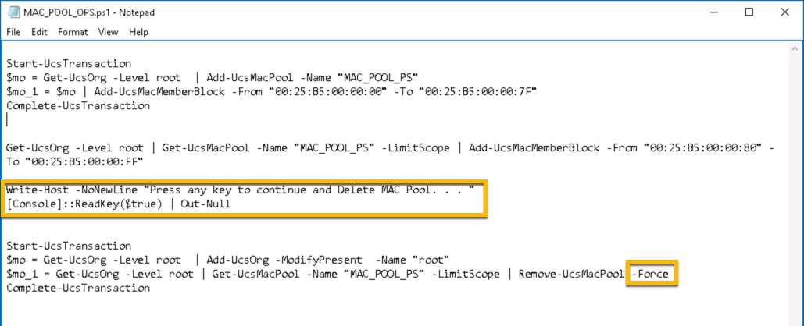<br/><br/>

4. Run the script, check UCS Manager when the script pauses to verify the creation of the MAC Pool and after the script completes to verify the deletion (Removal) of the MAC Pool.

  </br>Run MAC_POOL_OPS.ps1:

  <br/><br/>

  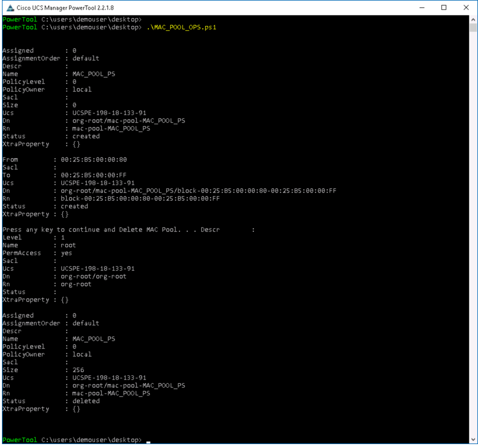<br/><br/>

  <br/><br/>

  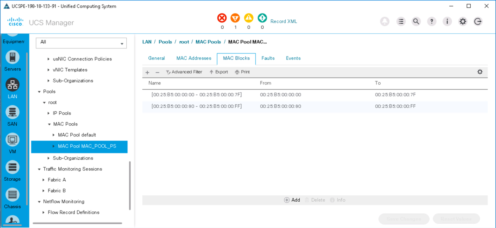<br/><br/>

  <br/><br/>

  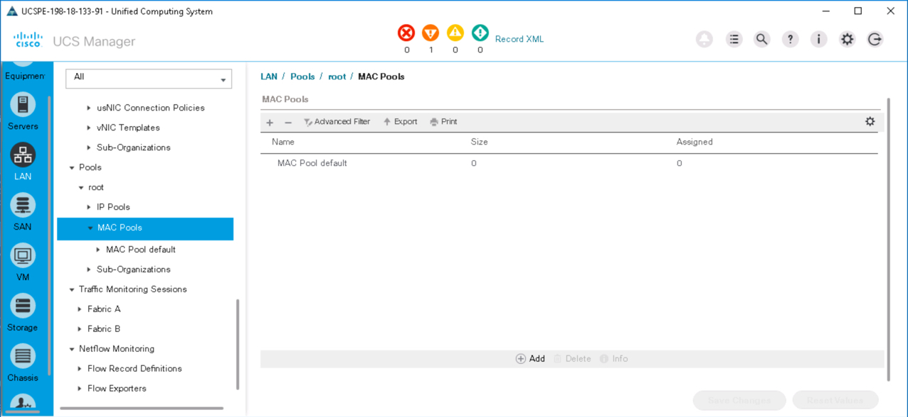<br/><br/>

Go to the next page to complete the Mission...
