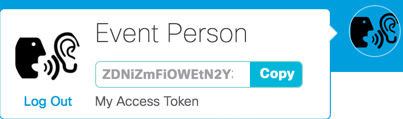

# Mission: Self-Service Compute Scripts built with PowerShell

### Mission Completion

  Run the PowerShell Script `Send-SparkMessage.ps1`

  1. Retrieve your Spark API Access Token. This token is your permanent developer token and is used to access Spark APIs.

    - Login to [Spark Developer Website](https://developer.webex.com/)
    - ***Click*** on your profile image
    - ***Click*** **Copy** to copy your access token to the clipboard<br/><br/>

    <br/><br/>

    <br/><br/>-->

  2. Change to the directory "C:\Users\demouser\CiscoDevNet\code\dci\LM-1551 - introduction to powershell"

  3. Run the `Send-SparkMessage.ps1` Cmdlet, specify the following parameters:

    - -SparkApiToken - The value is your API Token in double quotes
    - -SparkRoomName - The value is the name of the Spark Room to send the message to in double quotes
    - -SparkMessage - The value is the message in double quotes

    ```PowerShell
    .\Send-SparkMessage.ps1 -SparkApiToken "ZDNiZmFiOWEtN2Y3Zi00YjI3LWI3NWItYmNkNzQxOTUyYmZiNWQ0ZTY5N2ItOT" -SparkRoomName "DevNet Express DCI Event Room" -SparkMessage "I have completed the Self-Service Compute Scripts built with PowerShell Mission"
    ```

    <br/><br/>

    <br/><br/>-->

    <br/><br/>

    <br/><br/>-->

Congratulations you have completed the ***Self-Service Compute Scripts built with PowerShell Mission - UCS PowerTool***.
