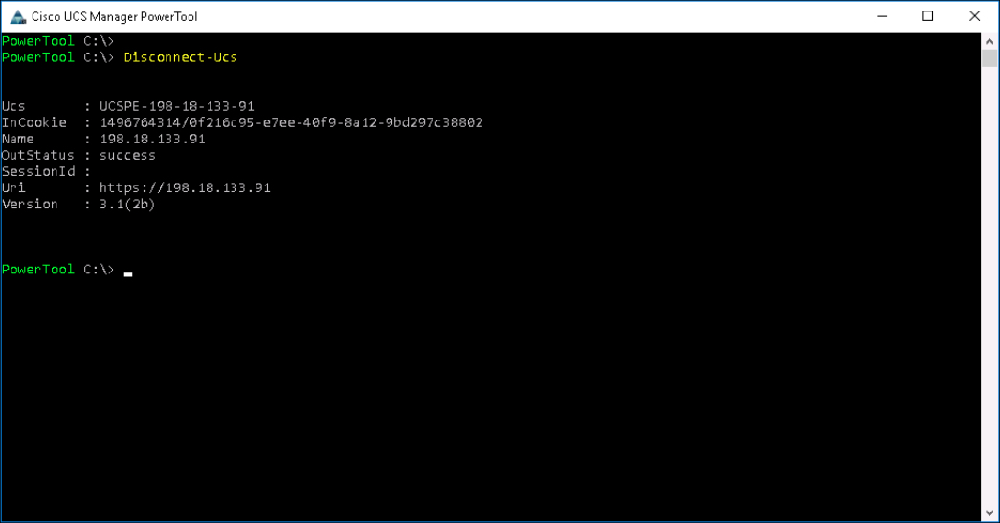

# More Powerful Cisco Compute PowerShell Scripts with UCS PowerTool

UCS PowerTool is a library of PowerShell Cmdlets that enable the management of UCS environments from Microsoft Operating Systems, via the UCS XML API.

Take UCS PowerTool to the **Next Level**, this lab covers Create a Microsoft Credential Object, Session Management, UCS PowerTool built-in metadata, UCS Admin Service Management and UCS Operation Transactions.

## Objectives

Completion time: 25 minutes

  - Microsoft Credential Object
  - Session Management
  - UCS Built-in Metadata
  - UCS Operation Transactions
  - UCS Admin Service Management
    - NTP
    - Timezone
    - DNS

## Prerequisites

Basic knowledge of UCS Compute, PowerShell and UCS PowerTool would be very helpful. However, this lab guide provides step-by-step procedures. Other than that, a desire to learn is all you need to bring with you.

## UCS PowerTool
UCS PowerTool is a library of Microsoft PowerShell Cmdlets (pronounced command-lets) that enable the retrieval and manipulation of UCS Manager managed objects. UCS Manager API interaction can be categorized into several distinct sections:  

  - Sessions
  - Methods
  - Queries and Filters
  - Configurations and Transactions
  - Event Subscription

UCS PowerTool provides services and Cmdlets for all the categorizations of UCS Manager API interactions, along with Cmdlets that allow for the inspection of object metadata, object hierarchical containment and object Cmdlet action capabilities with pipeline object definitions.

UCS PowerTool Cmdlets follow the same structure as PowerShell Cmdlets (verb-noun) utilizing the defined [Microsoft PowerShell Verbs.](https://msdn.microsoft.com/en-us/library/ms714428%28v=vs.85%29.aspx) UCS PowerTool Cmdlet **nouns** are the UCS objects. For example, to retrieve compute blade objects from UCS Manager, utilize the `Get-UcsBlade` Cmdlet.  The `Get-UcsBlade` Cmdlet will retrieve all the UCS compute blade objects from all currently connected UCS Managers.

## UCS PowerTool Download and Documentation
UCS PowerTool for UCS Manager is a component in the UCS PowerTool Suite.  In addition to UCS Manager management capabilities in UCS PowerTool, there is also a Cmdlet library for UCS Central and UCS IMC. UCS Central PowerTool library provides Cmdlets to manage UCS Central. UCS Central is a manager of UCS Managers. UCS IMC PowerTool is a collection of Cmdlets to manage the Cisco IMC (Integrated Management Controller) component of the UCS C, E and S Series servers.

To use UCS PowerTool in your environment be sure to [download](https://software.cisco.com/download/type.html?mdfid=286305108&flowid=79283) and get the [documentation](http://www.cisco.com/c/en/us/td/docs/unified_computing/ucs/sw/msft_tools/powertools/ucs_powertool_book/UCSM_Pwrtool_UG_2x.html).

# Step 1

This lab focuses on UCS PowerTool for UCS Manager. However, the methods shown here are applicable to IMC PowerTool and UCS Central PowerTool.

### Exercise 1
Launch UCS PowerTool, connect to a UCS Manager, and disconnect from the UCS Manager.

  1. Launch UCS PowerTool by ***double-clicking*** the UCS PowerTool icon on the Desktop.

  UCS PowerTool Icon:

    <br/><br/>

    <!--<br/><br/>-->

  2. A UCS PowerTool for UCS Manager Console will open, at the prompt type:

    - `Connect-Ucs -Name 198.18.133.91`

  3. Use the credentials below in the login dialog

    - User: admin
    - Password: C1sco12345

  </br>Connect-Ucs credentials dialog:

    <br/><br/>

    <!--<br/><br/>-->

  4. Disconnect from the UCS, at the prompt type:

    - `Disconnect-Ucs`

  Disconnect-Ucs output:

  <br/><br/>

  <!--<br/><br/>-->

  This is the connect and disconnect process for UCS however if you are running a script clearly automation cannot happen if a dialog box pops up and asks for a **User Name** and **Password**. To allow for UCS PowerTool scripts to run in an automated fashion use the PowerShell Credential Object.

  The PowerShell Credential Object can be passed to a UCS PowerTool `Connect-Ucs` Cmdlet.

### Exercise 2

Create a PowerShell Credential Object and use with the `Connect-Ucs` Cmdlet.

  The PowerShell Credential Object requires two components.

  - The **Password** converted to a `securestring`
  - The **User Name**

 1. Create the Credential object, the operation can be done in one line, at the prompt type:

  ```PowerShell
  $credentials = new-object -typename System.Management.Automation.PSCredential -argumentlist "admin",$(convertto-securestring -Force -AsPlainText "C1sco12345")
  ```

 2. Connect to UCS Manager, at the prompt type:

   - `Connect-Ucs -Name 198.18.133.91 -Credential $credentials`

  </br>Connect-Ucs with $credentials:

   <br/><br/>

   <!--<br/><br/>-->

### Exercise 3

There is another method of non-interactive login to UCS Manager. `Connect-Ucs` can utilize a previous session's exported credentials as input.

Export a UCS Session and use with the `Connect-Ucs` Cmdlet.

  1. Create a directory, at the command prompt type

  ```PowerShell
  New-Item -ItemType Directory ucs-sessions
  ```

  2. Export the current UCS PSSession, at the command prompt type

  ```PowerShell
  Export-UcsPSSession -Path C:\ucs-sessions\ucs-login.xml -Key $(convertto-securestring -Force -AsPlainText "C1sco12345")
  ```


  3. View a directory listing of C:\ucs-sessions, at the prompt type:

    - `dir C:\ucs-sessions`

    </br>Export-UcsPSSession and ucs-login.xml file:

      <br/><br/>

      <!--<br/><br/>-->

  4. Connect to UCS Manager, at the prompt type:

  ```PowerShell
  Connect-Ucs -Path C:\ucs-sessions\ucs-login.xml -Key $(convertto-securestring -Force -AsPlainText "C1sco12345")
  ```

  </br>Connect-Ucs with ucs-login.xml file:

  <br/><br/>

  <!--<br/><br/>-->

Next Step: UCS Object Metadata in PowerTool.
