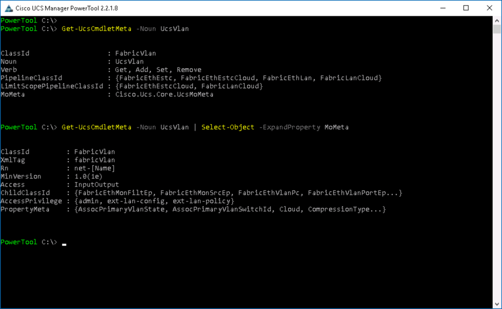
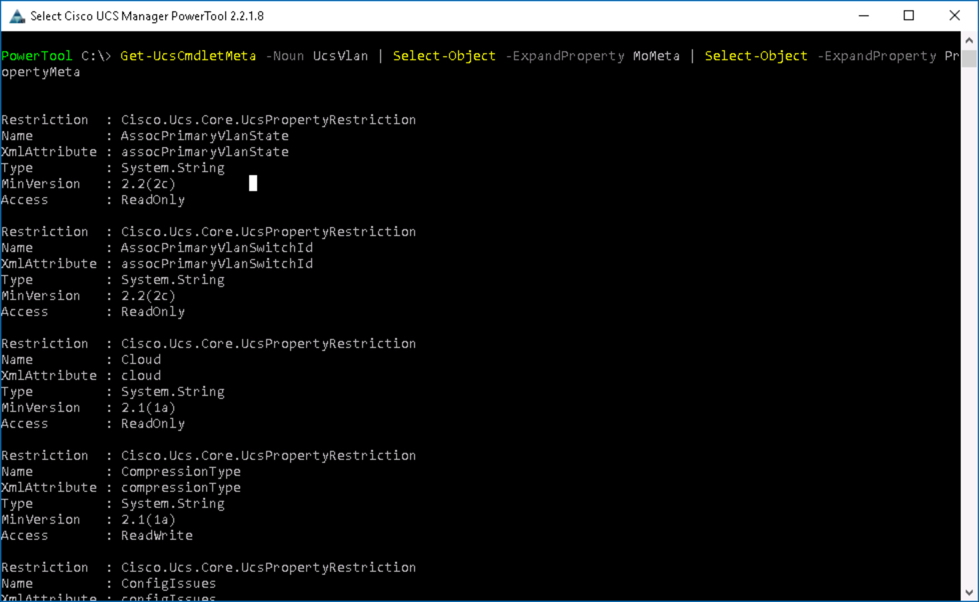
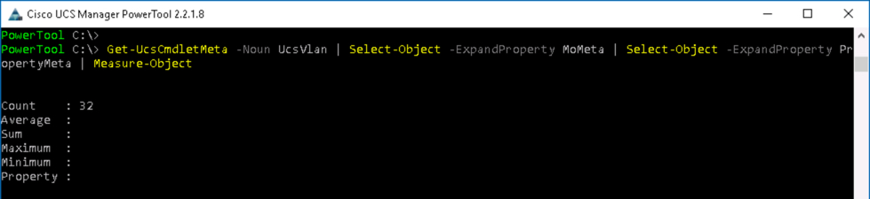
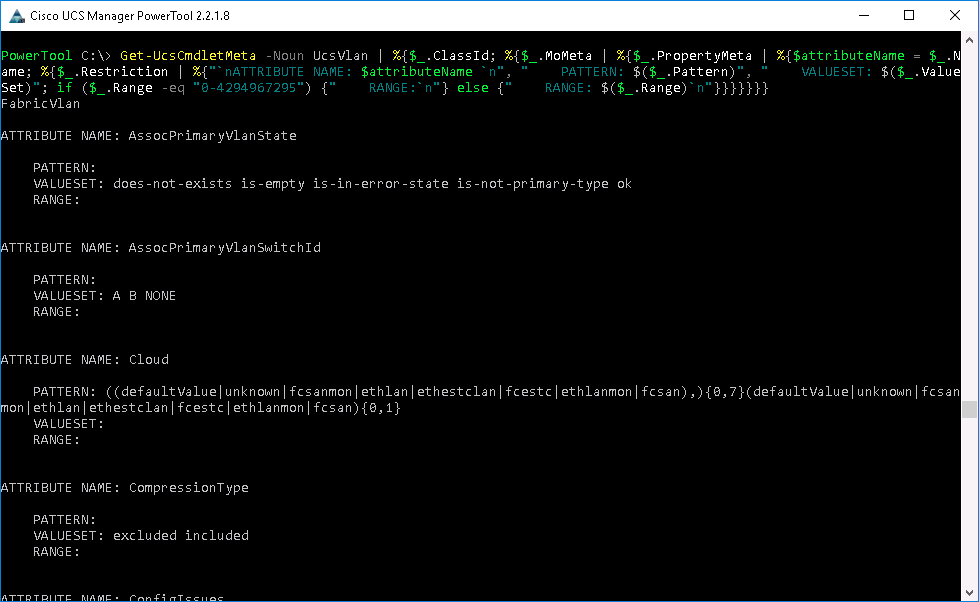
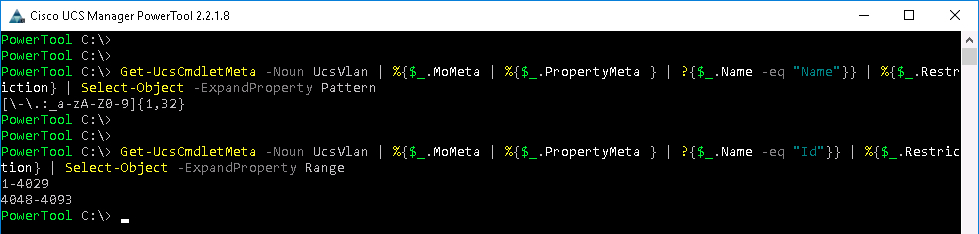
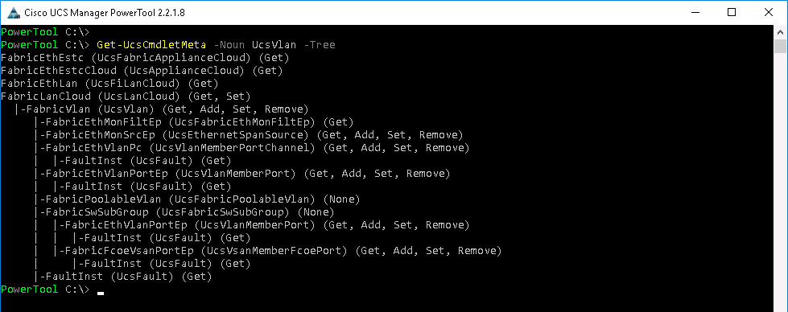

# More Powerful Cisco Compute PowerShell Scripts with UCS PowerTool

# Step 2

With any programming/scripting language interacting with the UCS Manager objects requires that you know something about the objects. UCS PowerTool has built-in metadata about UCS the objects, [metadata](https://en.wikipedia.org/wiki/Metadata) is data about the data.

UCS PowerTool Object metadata provides a wealth of information about UCS Objects.

  - Where the object is contained in the Object Model
  - Children objects are contained by the object
  - The object attributes
  - The acceptable values/restrictions for each attribute
    - Regular expression and length
    - Numerical Ranges
    - Enumerations
    - Value list

  With the metadata built into UCS PowerTool, operations that can dynamically check input values or generate tests do not require hard coded values or values maintained in an external source. Those types of mechanisms can lead to difficult to debug scenarios.

  Built-in metadata ensures that your code can always access the latest UCS object definitions.

### Exercise 4

Explore UCS PowerTool Metadata, data about the PowerTool Cmdlets and the Objects the Cmdlets work on.

  1. View the metadata for a VLAN Object, at the prompt type:

    - `Get-UcsCmdletMeta -Noun UcsVlan`
    - `Get-UcsCmdletMeta -Noun UcsVlan | Select-Object -ExpandProperty MoMeta`

    </br>Get-UcsCmdletMeta VLAN Output:

    <br/><br/>

    <br/><br/>-->

  The output from these two commands provides a great deal of information.

    - The UCS Manager Object ClassId for a VLAN is FabricVlan

    - There are UCS PowerTool VLAN Cmdlets to
      - **Get**
      - **Add**
      - **Set**
      - **Remove**

    - There are four types of VLAN Pipeline Objects (parent objects) that UcsVlan Cmdlets work with

    - There are two types of VLAN Pipeline Objects (parent objects) that UcsVlan Cmdlets work with when the Scope of the Cmdlet is limited (beyond the scope of this lab)

  Going Deeper in to the MoMeta (**Managed Object** Metadata) information:

    - The UCS Unified API XmlTag for a UCS VLAN is fabricVlan

    - The VLAN Object Rn (Relative Name) always starts with **net-**

    - VLAN Objects first appeared in UCS Manager in version 1.0(1e)

    - The Child Objects a VLAN *can* contain

    - The access privileges needed to work with VLANs

  2. Go even deeper into the PropertyMeta (Property Metadata), at the prompt type:

    - `Get-UcsCmdletMeta -Noun UcsVlan | Select-Object -ExpandProperty MoMeta | Select-Object -ExpandProperty PropertyMeta`

    </br>Get-UcsCmdletMeta VLAN PropertyMeta Output:

    <br/><br/>

    <br/><br/>-->

  A long list of VLAN Object Properties are displayed, if you want to know how many properties, at the prompt type:

    - `Get-UcsCmdletMeta -Noun UcsVlan | Select-Object -ExpandProperty MoMeta | Select-Object -ExpandProperty PropertyMeta | Measure-Object`

    </br>Get-UcsCmdletMeta VLAN PropertyMeta Count:

    <br/><br/>

    <br/><br/>-->

  3. Going a level deeper still, each Property has a **Restriction**, the restriction can be one of these type:

    - Pattern
    - ValueSet
    - Range

  To see all the Restrictions, at the prompt type:

    - `Get-UcsCmdletMeta -Noun UcsVlan | Select-Object -ExpandProperty MoMeta | Select-Object -ExpandProperty PropertyMeta | Select-Object -ExpandProperty Restriction`


  Many times you will see "0-4294967295" in the Range this can be ignored. Want to see every VLAN Object Attribute, with its' associated, Pattern, ValueSet, or Range (with the erroneous Range Value suppressed), at the prompt type:

  ```PowerShell
  Get-UcsCmdletMeta -Noun UcsVlan | %{$_.ClassId; %{$_.MoMeta | %{$_.PropertyMeta | %{$attributeName = $_.Name; %{$_.Restriction | %{"`nATTRIBUTE NAME: $attributeName `n", "    PATTERN: $($_.Pattern)", "    VALUESET: $($_.ValueSet)"; if ($_.Range -eq "0-4294967295") {"    RANGE:`n"} else {"    RANGE: $($_.Range)`n"}}}}}}}
  ```

  </br>Get-UcsCmdletMeta VLAN Attributes and Restrictions:

  <br/><br/>

  <br/><br/>-->

  That's a bit much, but the point is that the Object (information) returned from `Get-UcsCmdletMeta` is significant.

  4. When creating a UCS VLAN minimally two parameters are require:

    - **Name** - *Pattern* - `[\-\.:_a-zA-Z0-9]{1,32}`
    - **Id** - *Range* - `1-4029, 4048-4093`

  Retrieve the VLAN Name and Id attribute's Pattern or Range, at the prompt type:

    - `Get-UcsCmdletMeta -Noun UcsVlan | %{$_.MoMeta | %{$_.PropertyMeta } | ?{$_.Name -eq "Name"}} | %{$_.Restriction} | Select-Object -ExpandProperty Pattern`

    - `Get-UcsCmdletMeta -Noun UcsVlan | %{$_.MoMeta | %{$_.PropertyMeta } | ?{$_.Name -eq "Id"}} | %{$_.Restriction} | Select-Object -ExpandProperty Range`

    </br>Get-UcsCmdletMeta VLAN Name and Id Restrictions:

    <br/><br/>

    <br/><br/>-->

  5. View where a UCS Object resides in the UCS Object Model, at the prompt type:

    - `Get-UcsCmdletMeta -Noun UcsVlan -Tree`

    <br/><br/>

    <br/><br/>-->

  UCS Object Metadata is a powerful component of UCS PowerTool, methods show here can be used for any Object in the UCS Object Model.

Next Step: UCS Transactions.
