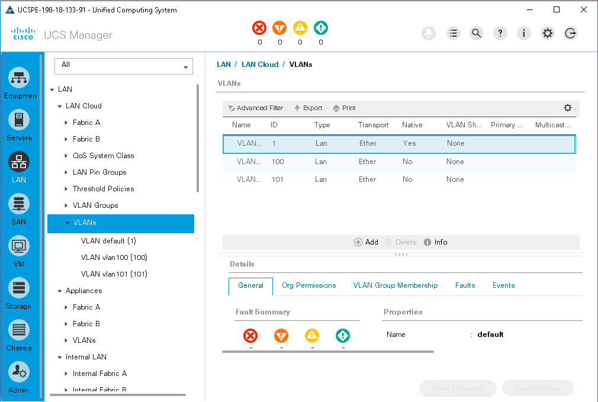

# More Powerful Cisco Compute PowerShell Scripts with UCS PowerTool

# Step 3

When configuring UCS Manager via UCS PowerTool the typical process is:

  - **Object Add** (Create)
    - Retrieve Object parent under which new object will be placed
    - **Add** new object and insert under parent

  - **Object Set** (Update)
    - Retrieve Existing Object
    - **Set** Object

  - Object Remove (Delete)
    - Retrieve Existing Object
    - **Remove** Object

Multiple operations can be done serially in a request response cycle or multiple operations can be done all at once in a Transaction.

UCS Transactions are much more efficient than requests being issued one by one. Additionally transactions have the added benefit of roll-back, if one operation in the transaction fails all the operations fail, you do not have to determine what worked and what did not.

A couple of things to point out are that the objects are not guaranteed to be processed in the order they are added to the transaction, nor can the objects in the transaction have a dependency on each other.

UCS Manager Object operations are ACID compliant

  - Atomic - "All operations in the transaction complete or all changes are discarded.
  - Consistent - "The UCS Object model will be in a valid state after the transaction completes"
  - Isolated - "Individual operations in the transaction can be processed in any order and the result will still be the same"
  - Durable - "The transaction is only complete when the object model changes has been written to the Object Model database."

This means that objects that are in the same transaction are not aware of each objects state until the transaction is completed and until those object changes are saved to the UCS Manager database, no other object operations can access the objects from the transaction.

To follow along in the UCS Manager GUI

1. Launch UCS Manager by ***double-clicking*** the UCS Manager icon on the Desktop.

  - **Username**: admin
  - **Password**: C1sco12345

  UCS Manger Icon:

  <br/><br/>

  <!--<br/><br/>-->

   - Select the LAN Section
   - Click on `VLANs` under the `LAN Cloud` group
   - Click on the **twistie** next to VLANs to expand the group.

### Exercise 5

Add (create), Set (update) and Remove (delete) a range of VLANs using UCS transactions.

  1. UCS PowerTool keeps track of transactions. There are two attributes in the UCS PSSession object that indicate a transaction in progress, at the prompt type

    - `Get-UcsPSSession`

    </br>Get-UcsPSSession  Output:

    <br/><br/>

    <!--<br/><br/>-->

  Notice the attributes NumPendingConfigs and TransactionInProgress

  `NumPendingConfigs` is 0

  `TransactionInProgress` is False

  2. Start a UCS Transaction, at the command prompt type

    - `Start-UcsTransaction`

    </br>Start-UcsTransaction:

    <br/><br/>

    <!--<br/><br/>-->

  Wow! Oh wait nothing happened. Hold on, look at the UCS PSSession again, at the prompt type

    - `Get-UcsPSSession`

    </br>Get-UcsPSSession after Start-UcsTransaction:

    <br/><br/>

    <!--<br/><br/>-->

  Now `TransactionInProgress` is True

  3. Add some VLANs, save the UCS `lanCloud` into a variable, regular ethernet VLAN objects are inserted into the UCS Object Model under the `lanCloud` object, at the prompt type

    - `$lanCloud = Get-UcsLanCloud`

  4. With the fabricLanCloud object stored in a variable let's add a VLAN, at the prompt type

    - `Add-UcsVlan -LanCloud $lanCloud -Name vlan100 -Id 100`

    - `Add-UcsVlan -LanCloud $lanCloud -Name vlan101 -Id 101`

    </br>Add-UcsVlan with a transaction:

    <br/><br/>

    <!--<br/><br/>-->

  5. Get the UCS PSSession again, at the prompt type

    - `Get-UcsPSSession`

    </br>Get-UcsPSSession with some transactions:

    <br/><br/>

    <!--<br/><br/>-->

  Now the value for `NumPendingConfigs` is 2, also if you were watching in the UCS Manager GUI no new VLANs have been added.

  6. Complete the transaction, at the prompt type

    - `Complete-UcsTransaction`

    </br>Complete-UcsTransaction:

    <br/><br/>

    <!--<br/><br/>-->

    <br/><br/>

    <!--<br/><br/>-->

  As if the `Add-UcsVlan` Cmdlets had been run one at a time the information for the added object is echoed on the console for each added object. As well the VLANs now are visible in the UCS Manager GUI.

  7. Set the VLANs Sharing attribute to `community` with a transaction, at the prompt type

  ```
  Start-UcsTransaction
  100..101 | %{Get-UcsVlan -Id $_} | Set-UcsVlan -Sharing community
  Complete-UcsTransaction -Force
  ```

  Without the `-Force` flag set on `Complete-UcsTransaction` you would have to verify each VLAN Set action.

  Check UCS Manager to verify that the `Sharing` attribute has been set to `Community`

  </br>VLAN Sharing Set to Community:

  <br/><br/>

  <!--<br/><br/>-->

  8. Remove the VLANs with a transaction, at the prompt type

  ```
  Start-UcsTransaction
  100..101 | %{Get-UcsVlan -Id $_} | Remove-UcsVlan
  Complete-UcsTransaction -Force
  ```

Now the VLAN objects have been removed and are no longer visible in UCS Manager GUI

  </br>VLANs Removed:

  <br/><br/>

  <!--<br/><br/>-->

Next Step: UCS Admin Service Management.
