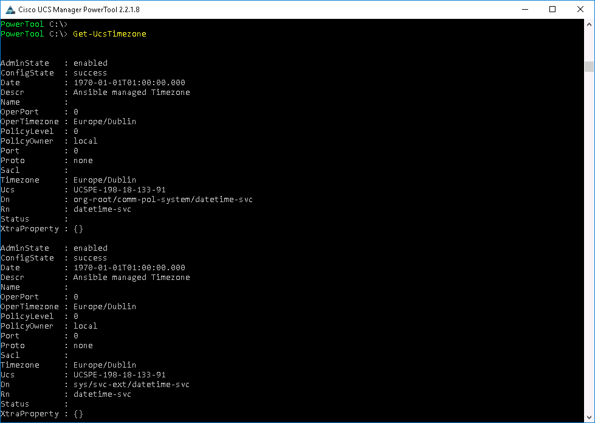
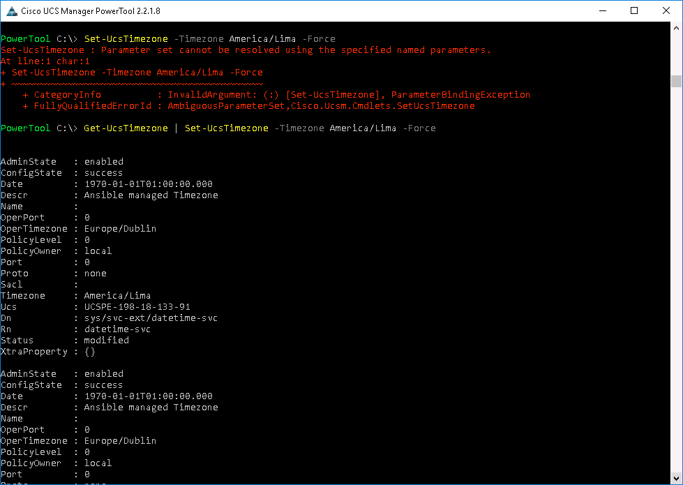
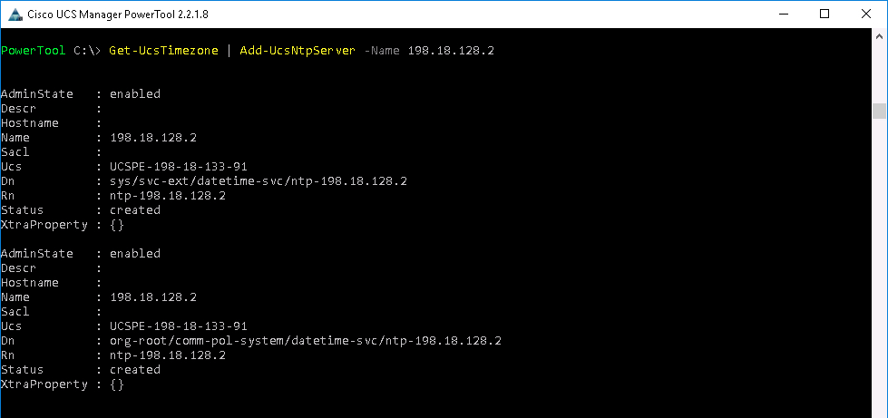
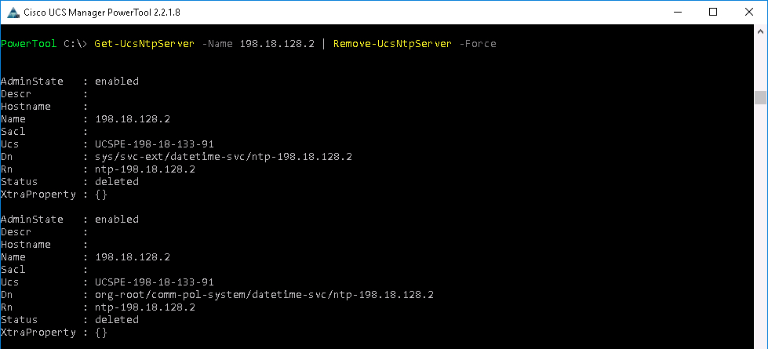
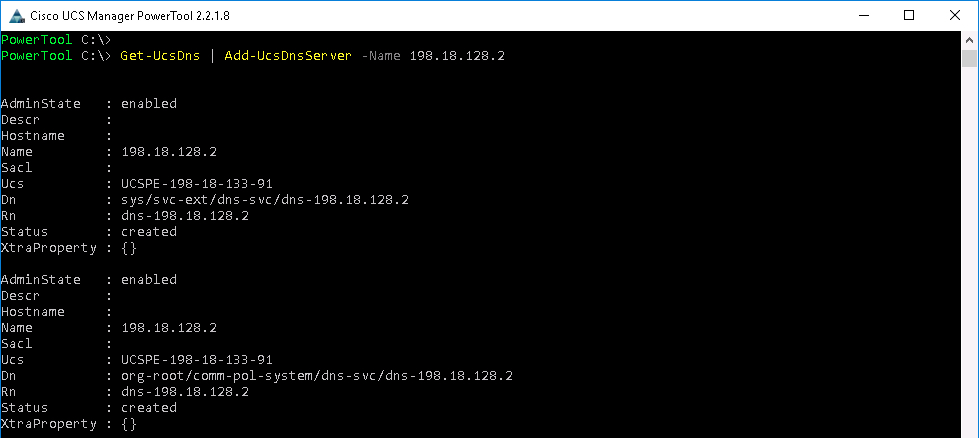
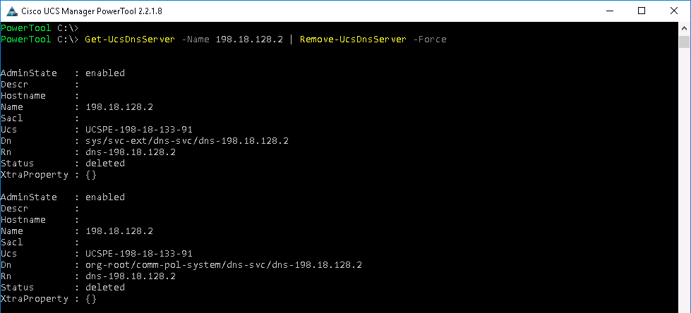

# More Powerful Cisco Compute PowerShell Scripts with UCS PowerTool

# Step 4

UCS Admin Service Management is management of settings like DNS, NTP and Timezone.  There are several Admin settings, all are manageable via UCS PowerTool.

### Exercise 6

  1. View some UCS Manager Admin settings, at the prompt type:

    - `Get-UcsTimezone`

     Get-UcsTimezone:

      

    <!--  -->

    - `Get-UcsNtpServer`

    - `Get-UcsDns`

    - `Get-UcsDnsServer`

    Some of the commands above may produce output and others may not, the reason is that some objects within the UCS Manager object model are implicit. That is they are always there and cannot be deleted. For example the Timezone object is present by default, however NTP Server objects are created only when NTP Servers are added to the UCS Manager configuration.

  2. Set the UCS Manager Timezone to 'America/Lima', at the prompt type:

    - `Set-UcsTimezone -Timezone America/Lima -Force`

  The command failed because the `object` to set is **unknown** to UCS PowerTool. UCS Manager objects can be set via PowerTool once the object is known, this is done by first performing a `Get` for a particular object and then pipelining the object to the Set command.

  3. Set the UCS Manager Timezone to 'America/Lima', at the prompt type:

    - `Get-UcsTimezone | Set-UcsTimezone -Timezone America/Lima -Force`

     Set-UcsTimezone:

      

    <!--  -->

  This time the output shows that the Timezone was Set to America/Lima.

  Timezone format is a string in [tzdata](https://en.wikipedia.org/wiki/Tz_database) form.

  4. Add an NTP Server, NTP servers are objects under the Timezone Object, at the prompt type:

    - `Get-UcsTimezone | Add-UcsNtpServer -Name 198.18.128.2`

     Add-UcsNtpServer:

      

    <!--  -->

  5. Remove an NTP Server, at the prompt type:

    - `Get-UcsNtpServer -Name 198.18.128.2 | Remove-UcsNtpServer -Force`

  Without the `-Force` parameter, the command would prompt for removal confirmation for the NTP Server object.

     Remove-UcsNtpServer:

      

    <!--  -->

  6. Add a DNS server, at the prompt type:

    - `Get-UcsDns | Add-UcsDnsServer -Name 198.18.128.2`

     Add-UcsDnsServer:

      

    <!--  -->

  Similar to NTP servers being objects under the Timezone Object. DNS Servers are objects under the DNS Object.

  7. Remove-UcsDnsServer, at the prompt type:

  `Get-UcsDnsServer -Name 198.18.128.2 | Remove-UcsDnsServer -Force`

     Remove-UcsDnsServer:

      

    <!--  -->

Congratulations! You've completed the lab *More Powerful Cisco Compute PowerShell Scripts with UCS PowerTool*.
