# Mission: Self-Service Compute Scripts built with Python

Take what you've learned about UCS Python SDK from the Learning Labs and put that knowledge to use.

## Objectives

Completion time: 15

  - Use UCS Python SDK to Create UCS Python SDK Code

## Prerequisites

Knowing a bit about Python helps, and since you've most likely completed the Programming Cisco Compute Learning Labs for UCS Python SDK, you are all set and ready to go.

In the UCS Python SDK Labs you wrote code to perform actions in UCS Manager, using various methods to determine the UCS Manger Object Name or ClassID to figure out which Python module to use.

There are hundreds of UCS Python SDK modules, which might sound a bit daunting. How will you ever find the correct module for the desired operation? Fortunately there is a UCS Python SDK method that will help considerably in writing Python scripts that use UCS Python SDK.

`convert_to_ucs_python()` provides the ability to use a log file created from the UCS Manager GUI to generate the UCS Python SDK code to perform the same actions as those captured in the log.

### Exercise 1

Let's Give it a try.

1. Launch UCS Manager by ***double-clicking*** the UCS Manager icon on the Desktop.

  - **Username**: `admin`
  - **Password**: `C1sco12345`

  </br>UCS Manager Icon:

  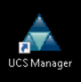<br/><br/>

  <!--<br/><br/>

2. Capture UCS Manager XML operations

Due to the access method for the dCloud Pod environments this next step requires the use of the On-Screen Keyboard on the Windows Desktop.

  </br>Windows On-Screen Keyboard:

  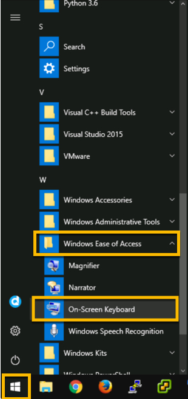<br/><br/>

  <!--<br/><br/>

The UCS Manager GUI Window must be active, ***Clicking*** on the UCS Manager Windows will not cause the On-Screen Keyboard to be pushed to the back.

The UCS Manager GUI Window Title state will indicate if the window is active.

  </br>Active vs. Inactive UCS Manager GUI Window:

  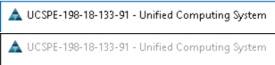<br/><br/>

  <!--<br/><br/>

With the On-Screen Keyboard open in front of the UCS Manager GUI

  - ***Click*** the keys Ctrl + Alt + q

  </br>***Click*** the keys Ctrl + Alt + q:

  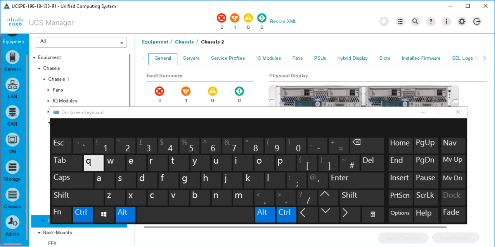<br/><br/>

  <!--<br/><br/>

  - ***Close*** the On-Screen Keyboard

  - ***Click*** the "Record XML" link to start logging. Once clicked the link will change to "Stop XML Recording

  - Perform operations in the GUI
    - ***Add*** a MAC Pool Named - "MAC_POOL_PY"
      - ***Right-Click*** "MAC Pools" in the "Pool" Group under the "root" Organization in the **LAN** Section.
      - ***Click*** "Create MAC Pool"
      - ***Enter*** "MAC_POOL_PY" in the "Name" field
      - ***Click*** "Next"
      - ***Click*** "Add"
      - ***Enter*** "128" in the "Size" field
      - ***Click*** "OK"
      - ***Click*** "Finish"
      - ***Click*** "OK"

    </br>MAC Pool Operations:

    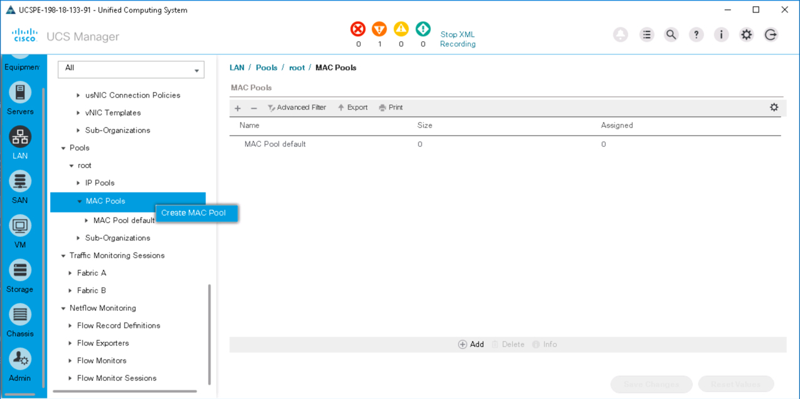<br/><br/>

    <!--<br/><br/>

    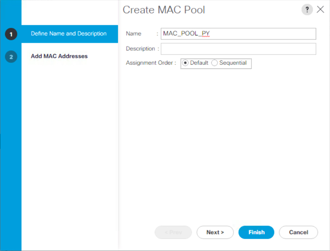<br/><br/>

    <!--<br/><br/>

    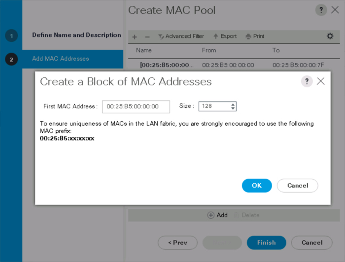<br/><br/>

    <!--<br/><br/>

    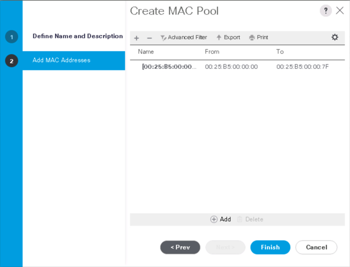<br/><br/>

    <!--<br/><br/>

    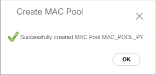<br/><br/>

    <!--<br/><br/>

    - ***Add*** another MAC Block
      - ***Click*** On the MAC Pool
      - ***Click*** On the "MAC Blocks" Tab
      - ***Click*** "Add"
      - ***Change*** "First MAC Address to" - "00:25:B5:00:00:80"
      - ***Enter*** "128" in the "Size" field
      - ***Click*** "OK"
      - ***Click*** "OK"

    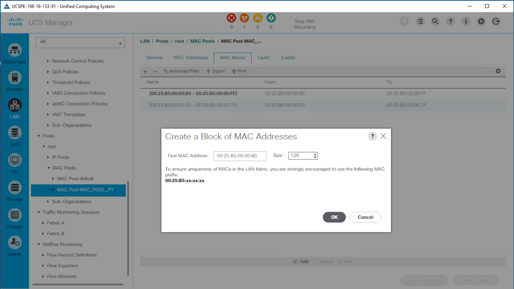<br/><br/>

    <!--<br/><br/>

    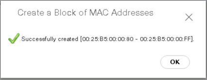<br/><br/>

    <!--<br/><br/>

    - ***Delete*** the MAC Pool
      - ***Right-Click*** on the MAC Pool
      - ***Click*** Delete
      - ***Click*** "Yes"
      - ***Click*** "OK"

    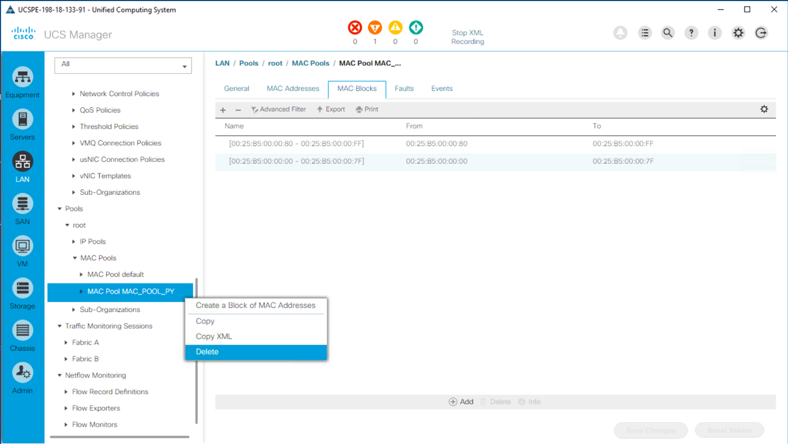<br/><br/>

    <!--<br/><br/>

    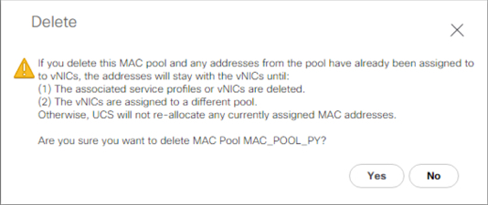<br/><br/>

    <!--<br/><br/>

    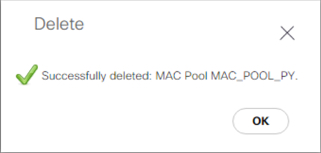<br/><br/>

    <!--<br/><br/>

    - ***Download*** the log file:
      - ***Click*** the "Stop XML Recording" link to stop logging
      - ***Enter*** - MAC_POOL_OPS_PY in the log file name pop-up
      - ***Click*** "OK", the file will download to `C:\users\demouser\Downloads\MAC_POOL_OPS_PY_xmlReq.log`
      - ***Click*** "Save"

    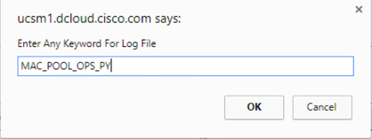<br/><br/>

    <!--<br/><br/>

    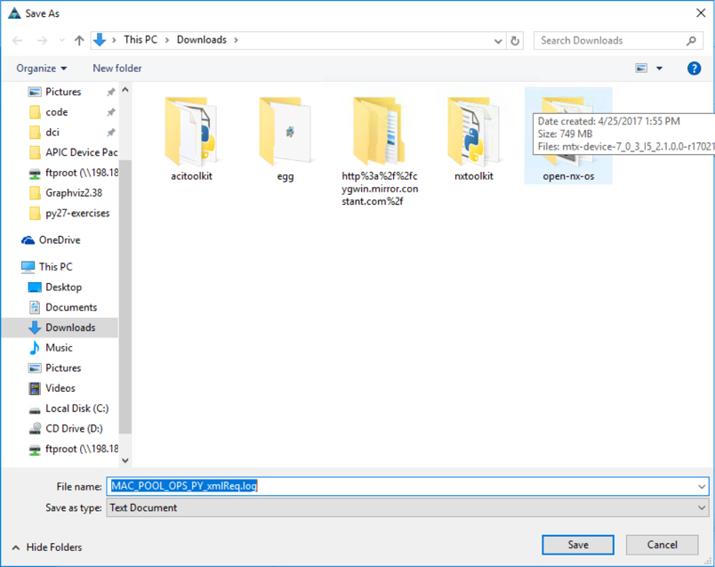<br/><br/>

    <!--<br/><br/>

2. Convert the captured log file to UCS Python Code

  - Launch the Python shell by ***double-clicking*** the **Terminal for Coding** icon on the Desktop.

  </br>Terminal for Coding Icon:

  <br/><br/>

  <!--<br/><br/>

3. At the prompt type:

  - **2** - to activate the Python 2 virtual environment
  - **python**

  </br>Enter into the Python Shell:

  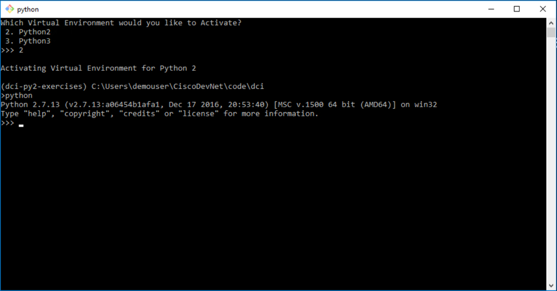<br/><br/>

  <!--<br/><br/>

4. Convert the captured log file to a UCS Python Code script

  ```Python
  from ucsmsdk.utils import converttopython

  converttopython.convert_to_ucs_python(xml=True, literal_path="C:\\Users\\demouser\\Downloads\\MAC_POOL_OPS_PY_xmlReq.log")
  ```

  ```Python
  from ucsmsdk.utils import converttopython

  converttopython.convert_to_ucs_python(xml=True,literal_path="C:\\Users\\demouser\\Downloads\\MAC_POOL_OPS_PY_xmlReq.log", dump_to_file=True, dump_file_path="C:\\Users\\demouser\\Desktop\MAC_POOL_OPS.py")
  ```

  </br>convert_to_ucs_python():

  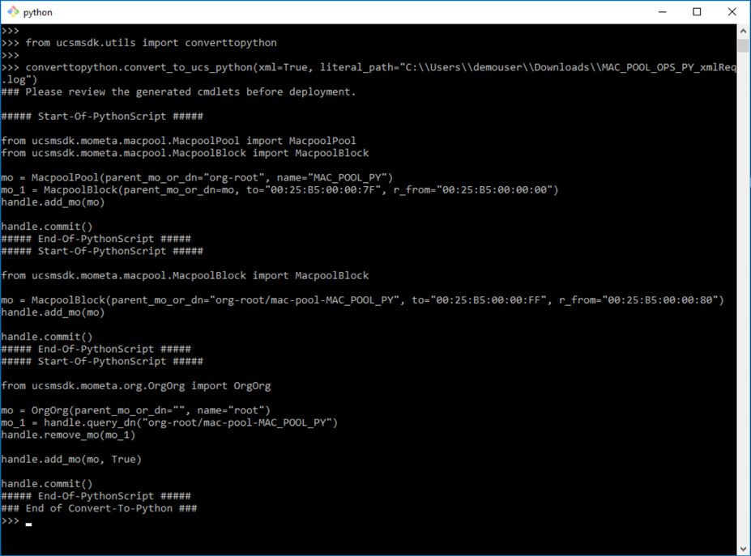<br/><br/>

  <!--<br/><br/>

  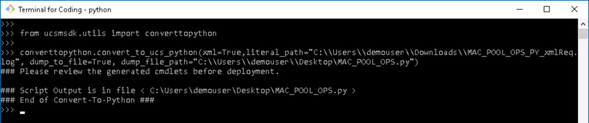<br/><br/>

  <!--<br/><br/>


5. Edit the script

  - The MAC_POOL_OPS.py python script will appear on the Desktop.
    - ***Right-Click*** the file `MAC_POOL_OPS_PY_xmlReq.log`
    - ***Select*** - "Edit with IDLE"
    - ***Click*** "OK" on IDLE Warning

  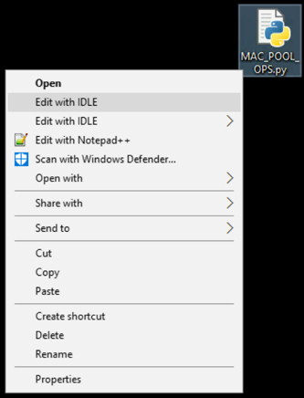<br/><br/>

  <!--<br/><br/>

  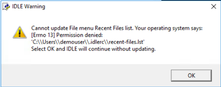<br/><br/>

  <!--<br/><br/>

  Add code to
  - login to UCS Manager
    ```Python
    from ucsmsdk.ucshandle import UcsHandle
    handle = UcsHandle("198.18.133.91", "admin", "C1sco12345")

    handle.login()
    ```

  - Pause before MAC Pool deletion

    `raw_input("MAC Pool Created and Updated. Press Enter to Delete Mac Pool...")`

  - Logout from UCS Manager

    `handle.logout()`

  </br>Edit MAC_POOL_OPS.py:

  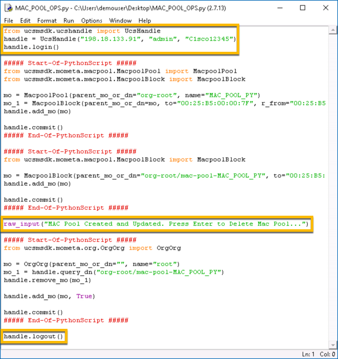<br/><br/>

  <!--<br/><br/>

  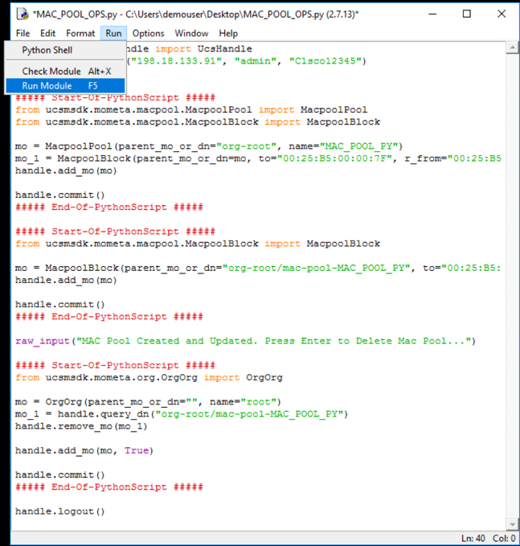<br/><br/>

  <!--<br/><br/>

  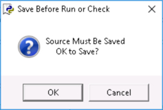<br/><br/>

  <!--<br/><br/>

6. Run the script, check UCS Manager when the script pauses to verify the creation of the MAC Pool and after the script completes to verify the deletion (Removal) of the MAC Pool.

  - ***Click*** "Run"
  - ***Click*** "Run Module"
  - ***Click*** "OK" to Save the script

  </br>Run MAC_POOL_OPS.py:

  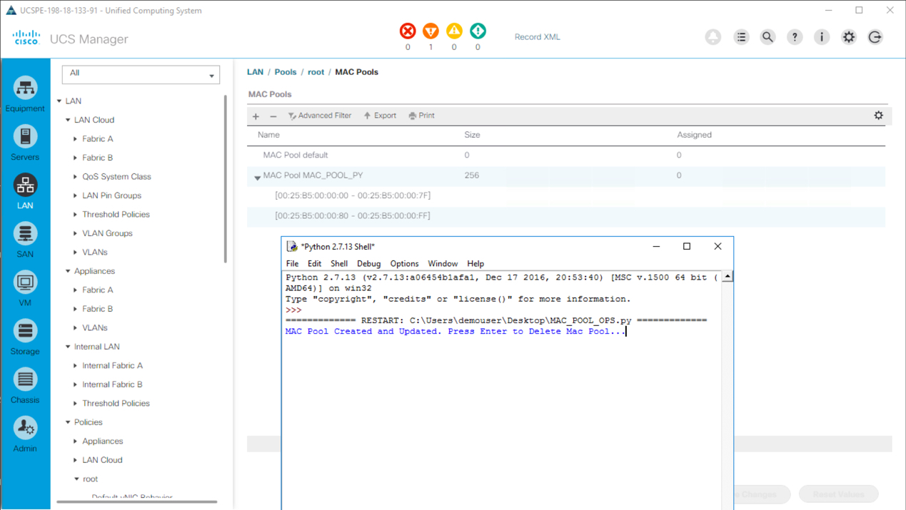<br/><br/>

  <!--<br/><br/>

  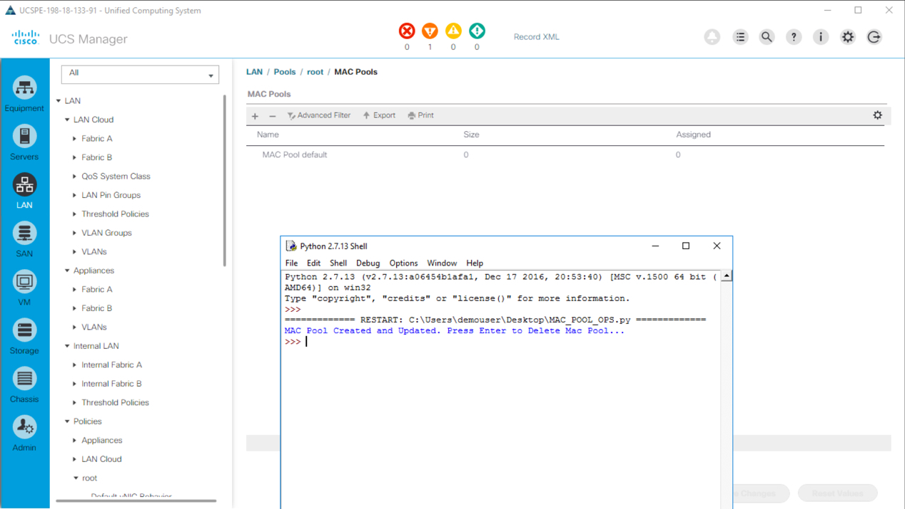<br/><br/>

  <!--<br/><br/>

Go to the next page to complete the Mission...
