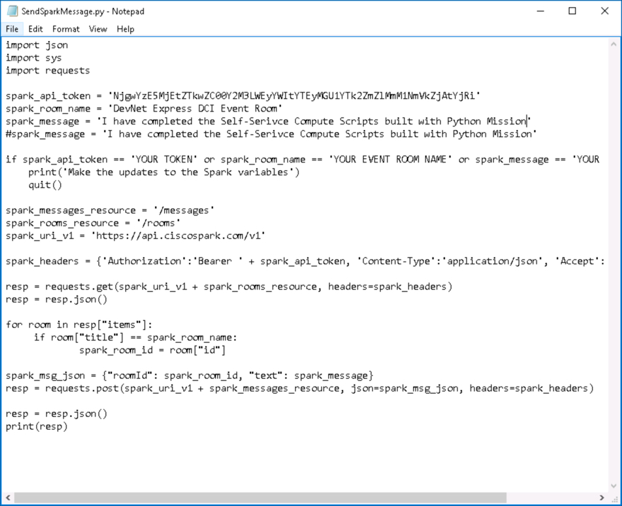
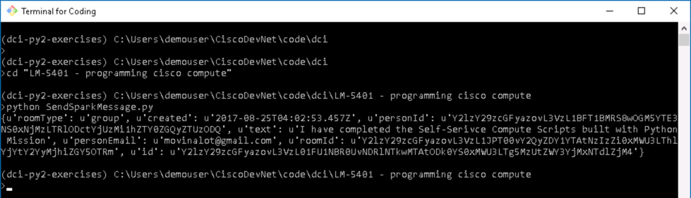

# Mission: Self-Service Compute Scripts built with Python

### Mission Completion

Update the **Event Spark Room** with a ***Completion Message***

  Run the Python Script `SendSparkMessage.py`

1. Retrieve your Spark API Access Token. This token is your permanent developer token and is used to access Spark APIs.

  - Login to [Spark Developer Website](https://developer.ciscospark.com/)
  - ***Click*** on your profile image
  - ***Click*** **Copy** to copy your access token to the clipboard  

    

  <!--  -->

2. Change to the code directory for LM-5401

  - On Windows the directory is "C:\Users\demouser\CiscoDevNet\code\dci\LM-5401 - programming cisco compute"
  - On linux the directory is "/home/csico.CiscoDevNet/code/dci/LM-5401 - programming cisco compute"

3. Edit `SendSparkMessage.py` and update these variables

  - spark_api_token = 'YOUR TOKEN'
  - spark_room_name = 'YOUR EVENT ROOM NAME'
  - spark_message = 'YOUR MESSAGE'
  #spark_message = 'I have completed the Self-Service Compute Scripts built with Python Mission'

4. Run `python SendSparkMessage.py`, specify the following parameters:

    

  <!--  -->

    

  <!--  -->

    

  <!--  -->

Congratulations you have completed the ***Self-Service Compute Scripts built with Python Mission - UCS Python SDK***.
