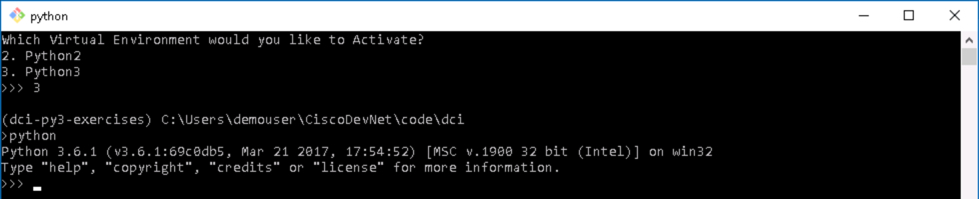
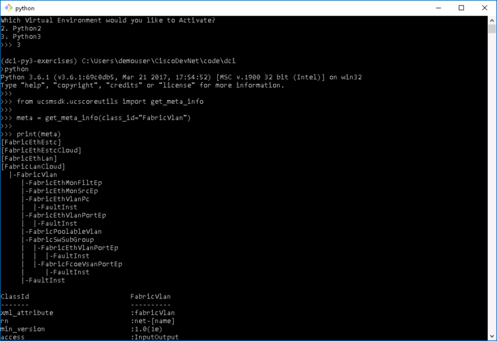
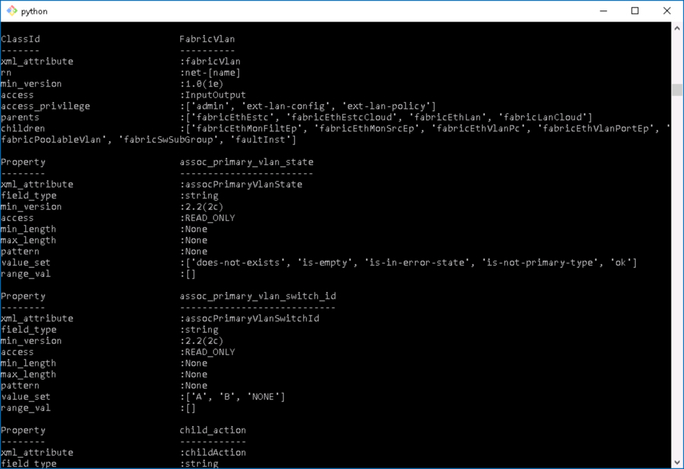
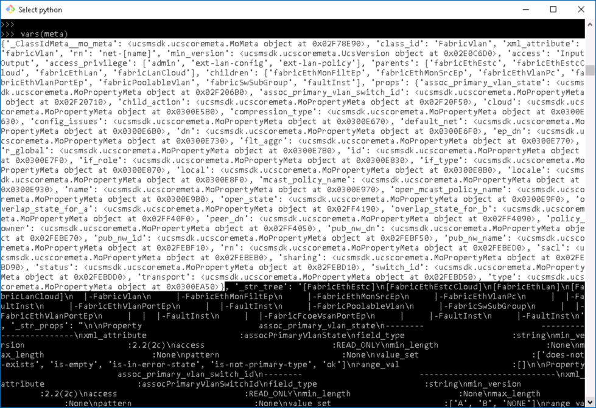
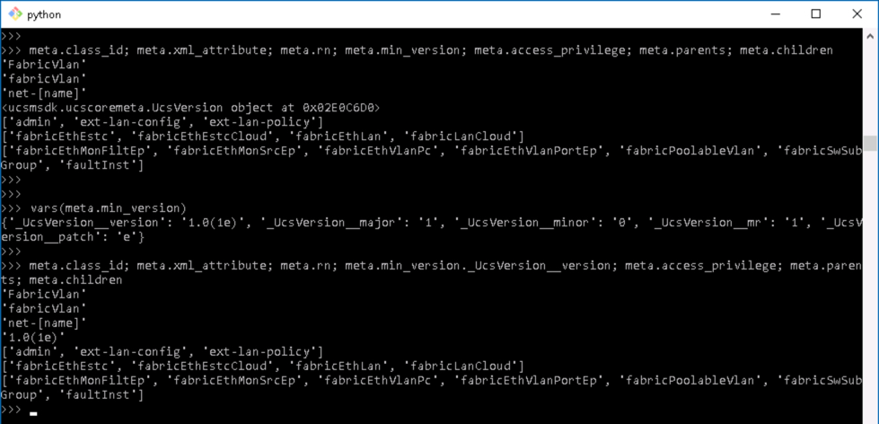
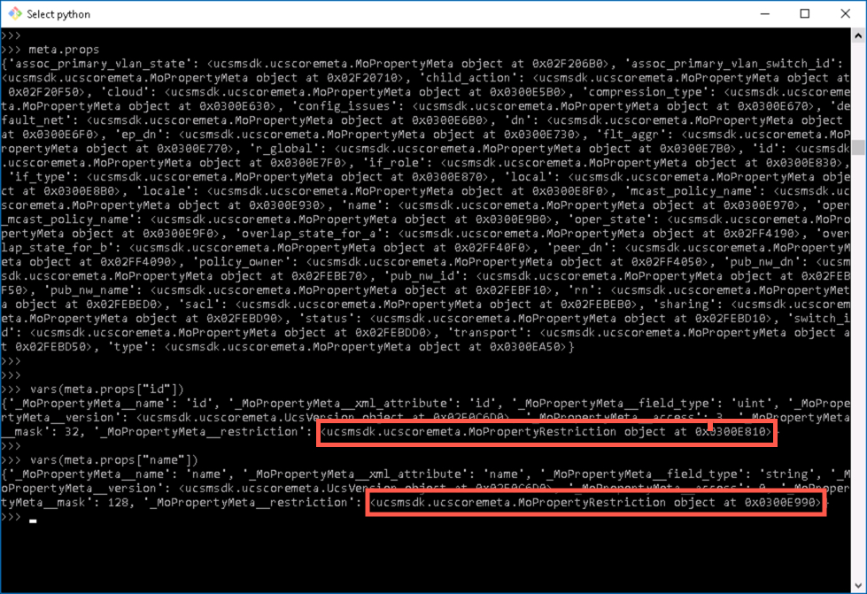
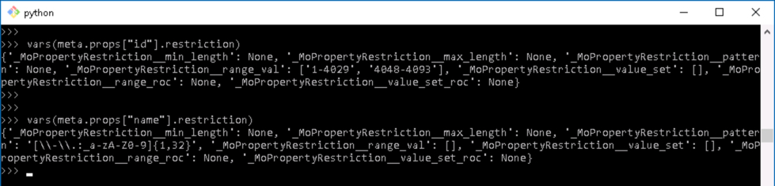
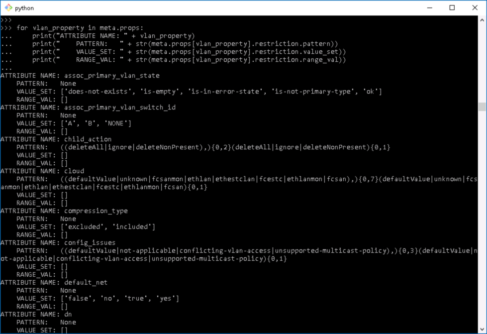
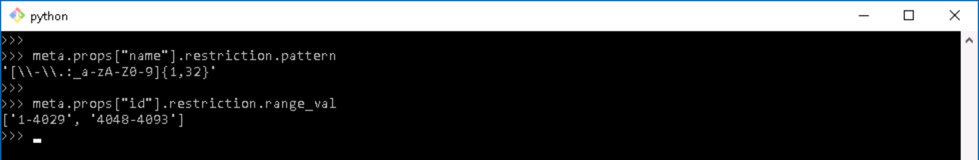

# More Powerful Cisco Compute Python Scripts with UCS Python SDK

UCS Python SDK is a library of Python Modules that enable the management of UCS environments from Python, via the UCS XML API.

Take UCS Python to the **Next Level**, this lab covers UCS Python SDK built-in metadata, UCS Operation Transactions, and UCS Admin Service Management.

## Objectives

Completion time: 20 minutes

  - UCS Built-in Metadata
  - UCS Operation Transactions
  - UCS Admin Service Management
    - NTP
    - Timezone

## Prerequisites

Basic knowledge of UCS Compute, and Python would be very helpful. However, this lab guide provides step-by-step procedures. Other than that, a desire to learn is all you need to bring with you.

## UCS Python SDK
UCS Python SDK is a library of Python module that enable the retrieval and manipulation of UCS Manager managed objects. UCS Manager API interaction can be categorized into several distinct sections:  

  - Sessions
  - Methods
  - Queries and Filters
  - Configurations and Transactions
  - Event Subscription

UCS Python SDK provides modules for all the categorizations of UCS Manager API interactions, along with functions that allow for the inspection of object metadata and object hierarchical containment.

## UCS Python SDK Download and Documentation
UCS Python SDK is a community supported project, the code, documentation and samples repositories are on [github.com](https://github.com/CiscoUcs/ucsmsdk).

# Step 1

This lab focuses on UCS Python SDK for UCS Manager. However, the methods shown here are applicable to IMC PowerTool and UCS Central PowerTool.

With any programming/scripting language interacting with the UCS Manager objects requires that you know something about the objects. UCS Pytthon SDK has built-in metadata about UCS the objects, [metadata](https://en.wikipedia.org/wiki/Metadata) is data about the data.

UCS Python SDK Object metadata provides a wealth of information about UCS Objects.

  - Where the object is contained in the Object Model
  - Children objects are contained by the object
  - The object attributes
  - The acceptable values/restrictions for each attribute

    - Regular expression and length
    - Numerical Ranges
    - Enumerations
    - Value list

With the metadata built into UCS Python SDK, operations that can dynamically check input values or generate tests do not require hard coded values or values maintained in an external source. Those types of mechanisms can lead to difficult to debug scenarios.

  Built-in metadata ensures that your code can always access the latest UCS object definitions.

### Exercise 1

***Code Sample*** - exercise-1.py - **LM-5451 - intermediate programming cisco compute**

Explore UCS Python SDK Metadata, data about the UCS Manger Objects.

  1. Launch the Python shell by ***double-clicking*** the **Terminal for Coding** icon on the Desktop.

    </br>Terminal for Coding Icon:

    <br/><br/>

    <!--<br/><br/>-->

  2. At the prompt type:

    - **3** - to activate the Python 3 virtual environment
    - **python**

  </br>Enter into the Python Shell:

    <br/><br/>

    <!--<br/><br/>-->

  3. View the metadata for a VLAN Object, at the prompt type:

    ```Python
    from ucsmsdk.ucscoreutils import get_meta_info

    meta = get_meta_info(class_id="FabricVlan")
    print(meta)
    ```

  The output from this code provides a great deal of information. At the very top of the output is the Object Model tree structure showing where a UCS VLAN object is contained and what children objects the VLAN Object contains.

    </br>get_meta_info(class_id="FabricVlan") Output:

    <br/><br/>

    <!--<br/><br/>-->

  Following the Object Model tree is metadata about the object class

    - The UCS Unified API `ClassId` for a UCS VLAN is `fabricVlan`

    - The VLAN Object Rn (Relative Name) always starts with **net-**

    - VLAN Objects first appeared in UCS Manager in version 1.0(1e)

    - The access privileges needed to work with VLANs

    - The Parent Objects of a VLAN

    - The Child Objects a VLAN *can* contain

    </br>get_meta_info(class_id="FabricVlan") Output continued:

    <br/><br/>

    <!--<br/><br/>-->

  4. Accessing the data is a combination of (.) dot accessors and array [] indexing. The first thing to do is look at the variable `meta` itself, at the prompt type:

    ```Python
    vars(meta)
    ```

    </br>vars(meta) Output:

    <br/><br/>

    <!--<br/><br/>-->

  The highlighted portion of the image is where the metadata resides, the lower part of the output is the text based tree and properties that print out when the variable `meta` is printed.

  Both the tree and detailed properties listing can be turned off by passing these prarmeters to the `get_meta_info()` functions

    - `show_tree=False`
    - `include_prop=False`

  5. Access the Object Class Metadata, at the prompt type:

    ```Python
    meta.class_id; meta.xml_attribute; meta.rn; meta.min_version; meta.access_privilege; meta.parents; meta.children
    ```

    This output is produced

    ```Python
    'FabricVlan'
    'fabricVlan'
    'net-[name]'
    <ucsmsdk.ucscoremeta.UcsVersion object at 0x02E0C6D0>
    ['admin', 'ext-lan-config', 'ext-lan-policy']
    ['fabricEthEstc', 'fabricEthEstcCloud', 'fabricEthLan', 'fabricLanCloud']
    ['fabricEthMonFiltEp', 'fabricEthMonSrcEp', 'fabricEthVlanPc', 'fabricEthVlanPortEp', 'fabricPoolableVlan', 'fabricSwSubGroup', 'faultInst']
  ```

  When you see in the output a reference to something that looks like this `<ucsmsdk.ucscoremeta.UcsVersion object at 0x02E0C6D0>` that indicates that the is another object that can be looked deeper into. To find out what that object looks like, first determine which item it correlates with in the code that generated that output.

  It is the fourth item in the output so it correlates to the fourth item in the code, `meta.min_version` To find out what is in `meta.min_version` use the `vars()` function.

    ```Python
    vars(meta.min_version)
    ```

  This output is produced

    ```Python
    {'_UcsVersion__version': '1.0(1e)', '_UcsVersion__major': '1', '_UcsVersion__minor': '0', '_UcsVersion__mr': '1', '_UcsVersion__patch': 'e'}
    ```

  If you add a (.) accessor to retrieve `_UcsVersion__version` then the metadata version, or when the Object first appeared in UCS Manager will be displayed

    ```Python
    meta.class_id; meta.xml_attribute; meta.rn; meta.min_version._UcsVersion__version; meta.access_privilege; meta.parents; meta.children
    ```

  This output is produced

    ```Python
    'FabricVlan'
    'fabricVlan'
    'net-[name]'
    '1.0(1e)'
    ['admin', 'ext-lan-config', 'ext-lan-policy']
    ['fabricEthEstc', 'fabricEthEstcCloud', 'fabricEthLan', 'fabricLanCloud']
    ['fabricEthMonFiltEp', 'fabricEthMonSrcEp', 'fabricEthVlanPc', 'fabricEthVlanPortEp', 'fabricPoolableVlan', 'fabricSwSubGroup', 'faultInst']
  ```

    </br>Class Object Output:

    <br/><br/>

    <!--<br/><br/>-->

  6. Access the Object Property Metadata, let's look two properties in particular `name` and `id`, at the prompt type:

    ```Python
    meta.props

    meta.props["id"]
    meta.props["name"]
    ```

    </br>Object Property Output:

    <br/><br/>

    <!--<br/><br/>-->

  Each Property has a **Restriction** Object the restriction can be one of these types:

    - pattern
    - value_set
    - range_val

  To see the Restrictions, at the prompt type:

    ```Python
     vars(meta.props["id"].restriction)
     vars(meta.props["name"].restriction)
    ```

    </br>Object Restriction Output:

    <br/><br/>

    <!--<br/><br/>-->

  Want to see every VLAN Object Attribute, with its' associated, pattern, value_set, or range_val, at the prompt type:

    ```Python
    from ucsmsdk.ucscoreutils import get_meta_info

    meta = get_meta_info(class_id="FabricVlan")

    for vlan_property in meta.props:
      print("ATTRIBUTE NAME: " + vlan_property)
      print("    PATTERN:   " + str(meta.props[vlan_property].restriction.pattern))
      print("    VALUE_SET: " + str(meta.props[vlan_property].restriction.value_set))
      print("    RANGE_VAL: " + str(meta.props[vlan_property].restriction.range_val))
    ```

    </br>Object Restriction Values Output:

    <br/><br/>

    <!--<br/><br/>-->

  That's a bit much, but the point is that the Object (information) returned from `get_meta_info(class_id="FabricVlan")` is significant.

  7. When creating a UCS VLAN minimally two parameters are require:

    - **name** - *pattern* - `[\-\.:_a-zA-Z0-9]{1,32}`
    - **id** - *range_val* - `1-4029, 4048-4093`

  Retrieve the VLAN Name and Id attribute's pattern and range_val restrictions, at the prompt type:

    ```Python
    meta.props["name"].restriction.pattern
    meta.props["id"].restriction.range_val
    ```

    </br>Object Restriction Values for name and id Output:

    <br/><br/>

    <!--<br/><br/>-->

  UCS Object Metadata is a powerful component of UCS Python SDK, methods shown here can be used for any Object in the UCS Object Model.

Next Step: UCS Transactions.
