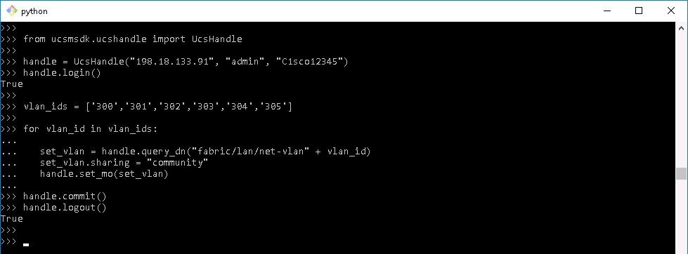
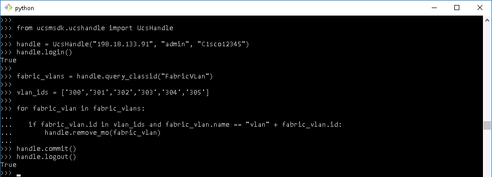

# More Powerful Cisco Compute Python Scripts with UCS Python SDK

# Step 2

When configuring UCS Manager via UCS Python SDK the typical process is:

  - **Object Add** (Create)
    - Retrieve Object parent under which new object will be placed
    - **add_mo** new object and insert under parent

  - **Object Set** (Update)
    - Retrieve Existing Object
    - **set_mo** Object

  - Object Remove (Delete)
    - Retrieve Existing Object
    - **remove_mo** Object

Multiple operations can be done serially in a request response cycle or multiple operations can be done all at once in a Transaction.

UCS Transactions are much more efficient than requests being issued one by one. Additionally transactions have the added benefit of roll-back, if one operation in the transaction fails all the operations fail, you do not have to determine what worked and what did not.

A couple of things to point out are that the objects are not guaranteed to be processed in the order they are added to the transaction, nor can the objects in the transaction have a dependency on each other.

UCS Manager Object operations are ACID compliant

  - Atomic - "All operations in the transaction complete or all changes are discarded.
  - Consistent - "The UCS Object model will be in a valid state after the transaction completes"
  - Isolated - "Individual operations in the transaction can be processed in any order and the result will still be the same"
  - Durable - "The transaction is only complete when the object model changes has been written to the Object Model database."

This means that objects that are in the same transaction are not aware of each objects state until the transaction is completed and until those object changes are saved to the UCS Manager database, no other object operations can access the objects from the transaction.
To follow along in the UCS Manager GUI

  1. Launch UCS PowerTool by ***double-clicking*** the UCS PowerTool icon on the Desktop.

    - **Username**: admin
    - **Password**: C1sco12345

    </br>UCS Manger Icon:

    <br/><br/>

    <!--<br/><br/>-->

     - Select the LAN Section
     - Click on `VLANs` under the `LAN Cloud` group
     - Click on the **twistie** next to VLANs to expand the group.

### Exercise 2

UCS Python SDK keeps track of transactions automatically. Every time and object operation is added to the `handle` the object the represents you session with a specific UCS Manager a transaction is created or updated.

  1. Add some VLANs in a UCS Transaction with this code, at the prompt type:

    ```Python
    from ucsmsdk.ucshandle import UcsHandle
    from ucsmsdk.mometa.fabric.FabricVlan import FabricVlan

    handle = UcsHandle("198.18.133.91", "admin", "C1sco12345")
    handle.login()

    fabric_lan_cloud = handle.query_classid("FabricLanCloud")

    vlan_ids = ['300','301','302','303','304','305']

    for vlan_id in vlan_ids:

        add_vlan = FabricVlan(parent_mo_or_dn=fabric_lan_cloud[0], name="vlan" + vlan_id, id=vlan_id)
        handle.add_mo(add_vlan)

    handle.commit()
    handle.logout()
    ```

    - Code breakdown
      - Import the `UcsHandle` Class - this class defines how you connect to UCS Manager
      - Import the `FabricVlan` Class - this class defines a FabricVlan Object
      - Instantiate a UcsHandle
      - Connect to UCS Manager with `login()`
      - Save the `FabricLanCloud` object to a variable - this is the parent under which new VLAN objects are inserted.
      - Define a list of VLANs ids
      - Loop through the list of `id` elements and create a VLAN object using the id as part of the VLAN name and as the id for the VLAN
      - Add the new VLAN object to the handle with `add_mo()`. The first time an object operation is added to the handle a transaction is created. With each successive object operation added to the handle the transaction is updated.
      - When the loop through the list of `id` elements is complete `commit()` the transaction.
      - Disconnect from UCS Manager with `logout()`

      </br>Add Vlans:

    <br/><br/>

    <!--<br/><br/>-->

    </br>UCS Manger View:

    <br/><br/>

    <!--<br/><br/>-->

  2. Set the VLANs Sharing attribute to `community` with a transaction, at the prompt type:

    ```Python
    from ucsmsdk.ucshandle import UcsHandle

    handle = UcsHandle("198.18.133.91", "admin", "C1sco12345")
    handle.login()

    vlan_ids = ['300','301','302','303','304','305']

    for vlan_id in vlan_ids:         
       set_vlan = handle.query_dn("fabric/lan/net-vlan" + vlan_id)
       set_vlan.sharing = "community"
       handle.set_mo(set_vlan)

    handle.commit()
    handle.logout()
    ```

    - Code Breakdown
      - The code is mostly the same, the FabricVlan class is not required, since you are not creating a VLAN but retrieving and setting a VLAN
      - Instantiate a UcsHandle
      - Connect to UCS Manager with `login()`
      - The same `id` list is used. However, this time the ids are used to create the distinguished name of the VLAN to retrieve.
      - The VLAN is retrieved
      - The `sharing` attribute is updated
      - Set the updated VLAN object to the handle with `set_mo`
      - When the loop through the list of `id` elements is complete `commit()` the transaction.
      - Disconnect from UCS Manager with `logout()`

    </br>Set Vlans:

    <br/><br/>

    <!--<br/><br/>-->

    </br>UCS Manger View:

    <br/><br/>

    <!--<br/><br/>-->

    Transactions are efficient and the code above was fairly efficient but it could be better.

    Every VLAN object that was updated, first had to be retrieved by using the dn of the VLAN a query was issued for each object.  The **more efficient** way would have been to query the class_id `FabricVlan` return all the VLANs and then update the VLANs that required updating.

    ```Python
    from ucsmsdk.ucshandle import UcsHandle

    handle = UcsHandle("198.18.133.91", "admin", "C1sco12345")
    handle.login()

    fabric_vlans = handle.query_classid("FabricVLan")

    vlan_ids = ['300','301','303','304','305']

    for fabric_vlan in fabric_vlans:

        if fabric_vlan.id in vlan_ids and fabric_vlan.name == "vlan" + fabric_vlan.id:
            fabric_vlan.sharing = "none"
            handle.set_mo(fabric_vlan)

    handle.commit()
    handle.logout()
    ```

     VLAN ID `302` was removed from the list to prove that the `if` statement was really doing what it was supposed to.

     - Code Breakdown
      - The differnece in this code is that all the `FabricVlan` objects on the UCS are queried for.
      - Instead of looping through the `ids` all the returned VLAN objects are looped through.
      - If a VLAN `id` is found in the `vlan_ids` list and the vlan `name` is equal to the string "vlan" suffixed with the `id` of that vlan then it is a vlan to update.

    This code is more efficient since the VLANs are not queried for one by one but in one large group by Class Id.

    </br>Set Vlans more Efficiently:

    <br/><br/>

    <!--<br/><br/>-->

    </br>UCS Manger View:

    <br/><br/>

    <!--<br/><br/>-->

  8. Remove the VLANs with a transaction, at the prompt type:

    ```Python
    from ucsmsdk.ucshandle import UcsHandle

    handle = UcsHandle("198.18.133.91", "admin", "C1sco12345")
    handle.login()

    fabric_vlans = handle.query_classid("FabricVLan")

    vlan_ids = ['300','301','302','303','304','305']

    for fabric_vlan in fabric_vlans:

      if fabric_vlan.id in vlan_ids and fabric_vlan.name == "vlan" + fabric_vlan.id:
          handle.remove_mo(fabric_vlan)

    handle.commit()
    handle.logout()
    ```

    - Code Breakdown
      - This code is almost identical to the previous code, however the `set_mo` was changed to a `remove_mo` to delete the VLAN
      - VLAN ID '302' was added back into the list

    </br>Remove Vlans:

    <br/><br/>

    <!--<br/><br/>-->

    </br>UCS Manger View:

    <br/><br/>

    <!--<br/><br/>-->

Next Step: UCS Admin Service Management.
