# More Powerful Cisco Compute Python Scripts with UCS Python SDK

# Step 3

UCS Admin Service Management is management of settings like NTP and Timezone.  There are several Admin settings, all are manageable via UCS Python SDK.

### Exercise 3
  1. View some UCS Manager Admin settings. To view the settings you will need to know the UCS `classid` of the object you want to query. You can UCS Manager to find out the ClassId.

    - To find the Timezone ClassId
      - ***Right-click*** on the Timezone Object in UCS Manager
      - ***Select*** "Copy XML" from the context menu

  The resulting dialog contains the XML of the object. The very fist item in the XML, the XML **Element** is the ClassId. These screenshots show the XML for Timezone and an NTP server which is a child object of Timezone.

    </br>Timezone ClassId:

    <br/><br/>

    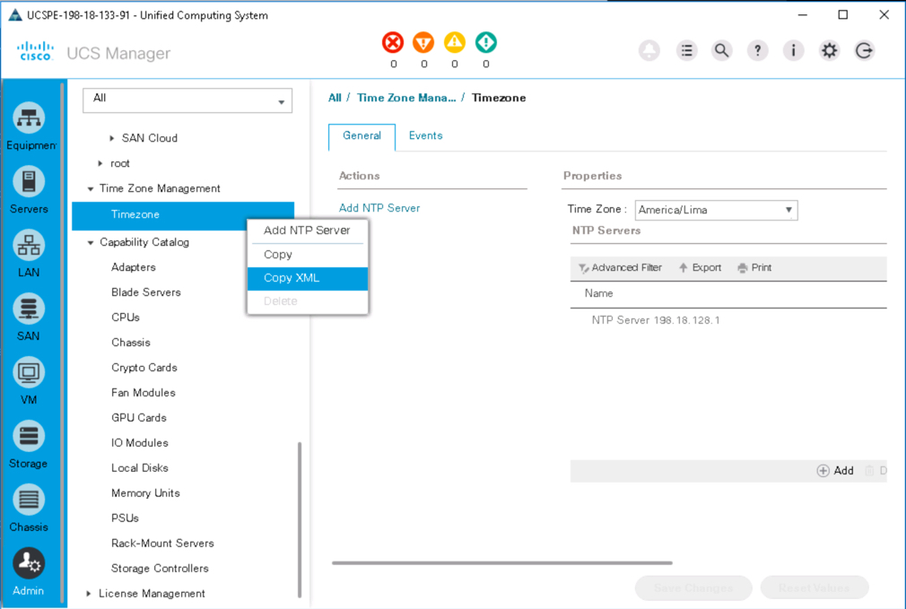<br/><br/>-->

    <br/><br/>

    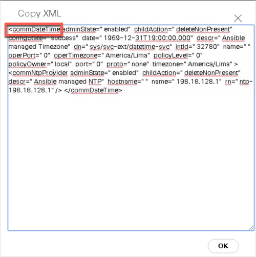<br/><br/>-->

    </br>NTP Server ClassId:

    <br/><br/>

    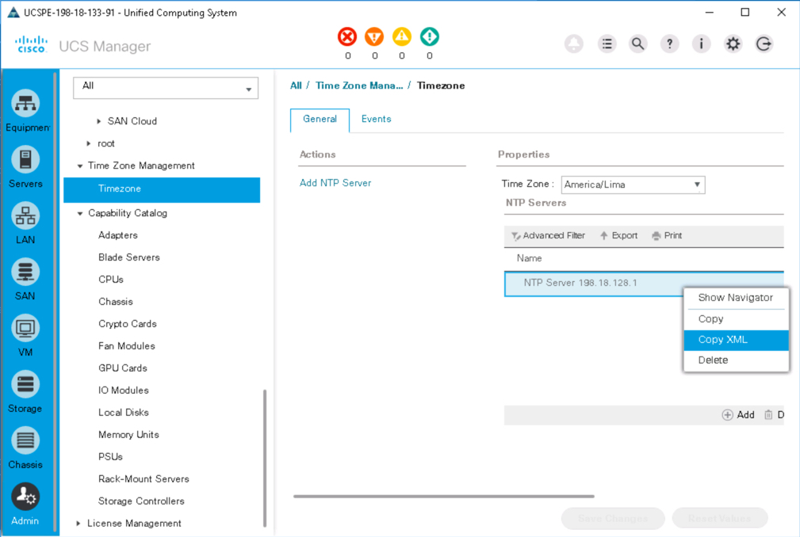<br/><br/>-->

    <br/><br/>

    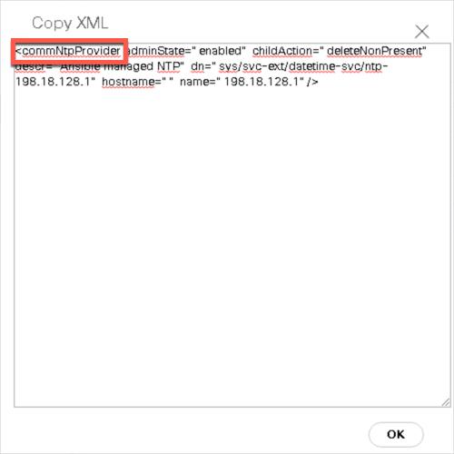<br/><br/>-->

    - Class Ids
      - **Timezone** -  ***commDateTime***
      - **NTP Servers** - ***commNtpProvider***

  2. View Timezone and NTP Servers, at the prompt type:

    ```Python
    from ucsmsdk.ucshandle import UcsHandle

    handle = UcsHandle("198.18.133.91", "admin", "C1sco12345")
    handle.login()

    for object in handle.query_classid("commDateTime"):
        print(object)

    for object in handle.query_classid("commDnsProvider"):
    print(object)

    handle.logout()
    ```

    </br>Timezone and NTP Server query:

    <br/><br/>

    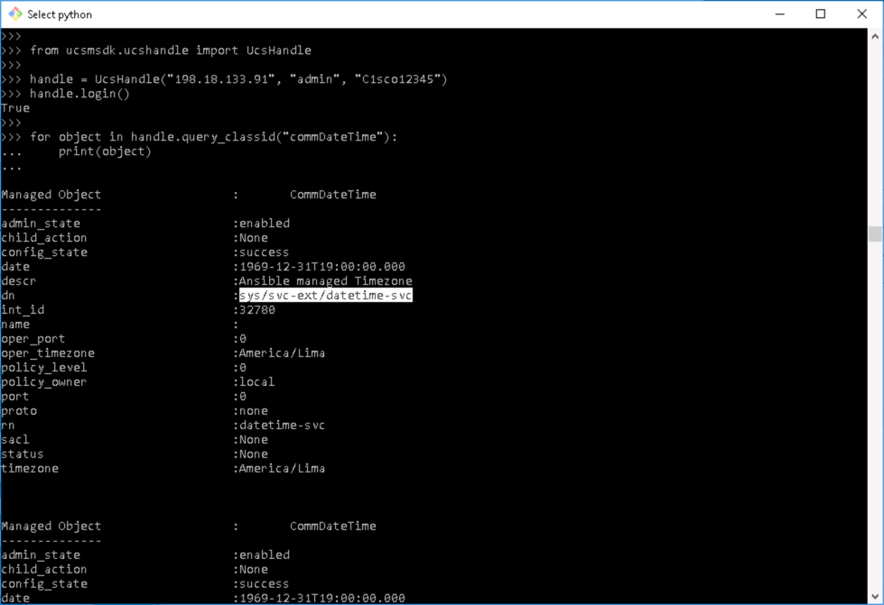<br/><br/>-->

    <br/><br/>

    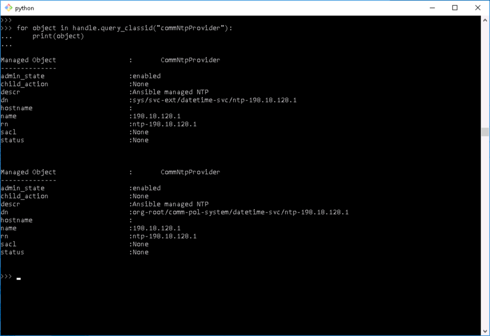<br/><br/>-->

  3. Setting the Timezone, like setting a VLAN or any other existing UCS Manager Object requires that you first retrieve the existing object, set the change and then commit the object.

  There were two Timezone objects returned when Timezone was queried, the change needs to be made in the object that has the `dn` thta starts with `sys`. The `dn` is highlighted in one of the screenshots above.

  Set the UCS Manager Timezone to '**America/Panama**', at the prompt type:

    ```Python
    from ucsmsdk.ucshandle import UcsHandle

    handle = UcsHandle("198.18.133.91", "admin", "C1sco12345")
    handle.login()

    timezone_mo = handle.query_dn("sys/svc-ext/datetime-svc")
    timezone_mo.timezone = "America/Panama"

    handle.set_mo(timezone_mo)
    handle.commit()

    handle.logout()
    ```

    - Code Breakdown
      - Query for the Timezone Management Object
      - Set the `timezone` attribute of the Timezone object
      - Add the object `set` to the handle
      - Commit the handle

  Timezone format is a string in [tzdata](https://en.wikipedia.org/wiki/Tz_database) form.

    </br>Set Timezone:

    <br/><br/>

    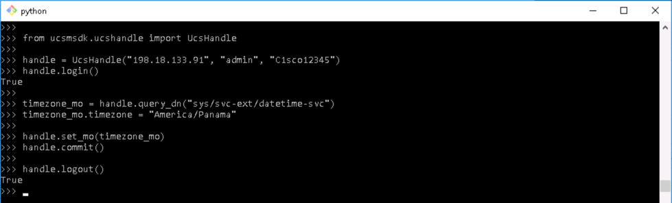<br/><br/>-->

    <br/><br/>

    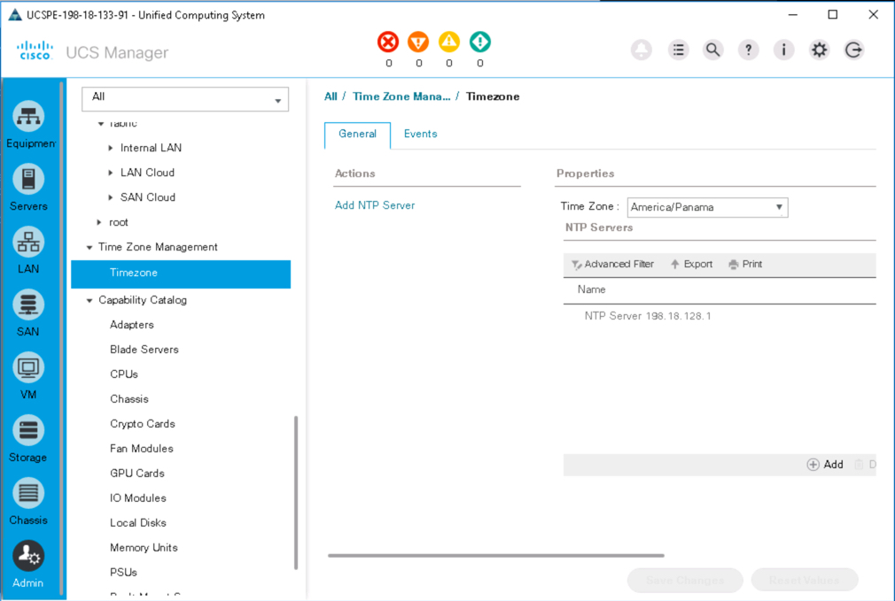<br/><br/>-->

  4. Add an NTP Server, NTP servers are objects under the Timezone Object, at the prompt type:

    ```Python
    from ucsmsdk.ucshandle import UcsHandle
    from ucsmsdk.mometa.comm.CommNtpProvider import CommNtpProvider

    handle = UcsHandle("198.18.133.91", "admin", "C1sco12345")
    handle.login()

    timezone_mo = handle.query_dn("sys/svc-ext/datetime-svc")

    ntp_provider_mo = CommNtpProvider(parent_mo_or_dn=timezone_mo, name="198.18.128.3")

    handle.add_mo(ntp_provider_mo)

    handle.commit()
    handle.logout()
    ```

    - Code Breakdown
      - Added an import for the `CommNtpProvider` Class to be able to instantiate/create an NTP Server Object
      - Queried the Timezone management object to be able to insert the NTP server as a child of the Timezone object
      - Created an NTP Server object and specified the parent object as the first parameter and set the name (IP) of the NTP server.
      - Add the object `add` to the handle
      - Commit the changes

    </br>Add NTP Server:

    <br/><br/>

    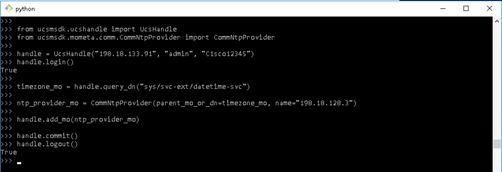<br/><br/>-->

    <br/><br/>

    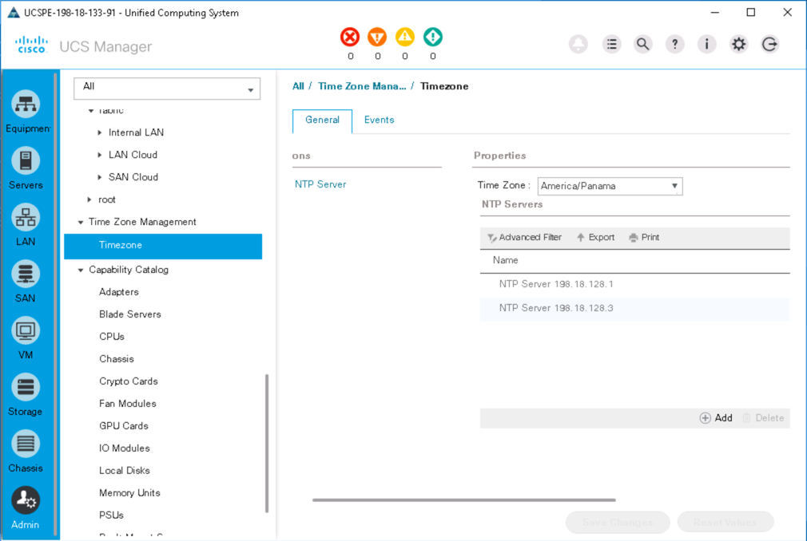<br/><br/>-->

  5. Remove an NTP Server, at the prompt type:

    ```Python
    from ucsmsdk.ucshandle import UcsHandle

    handle = UcsHandle("198.18.133.91", "admin", "C1sco12345")
    handle.login()

    ntp_provider_mo = handle.query_dn("sys/svc-ext/datetime-svc/ntp-198.18.128.3")
    handle.remove_mo(ntp_provider_mo)

    handle.commit()
    handle.logout()
    ```

    - Code Breakdown
      - Find the the NTP Server Object
      - Add the Object `remove` to the handle
      - Commit the changes

    </br>Remove NTP Server:

    <br/><br/>

    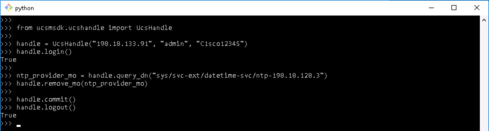<br/><br/>-->

    <br/><br/>

    <br/><br/>-->

Congratulations! You've completed the lab *More Powerful Cisco Compute Python Scripts with UCS Python SDK*.
