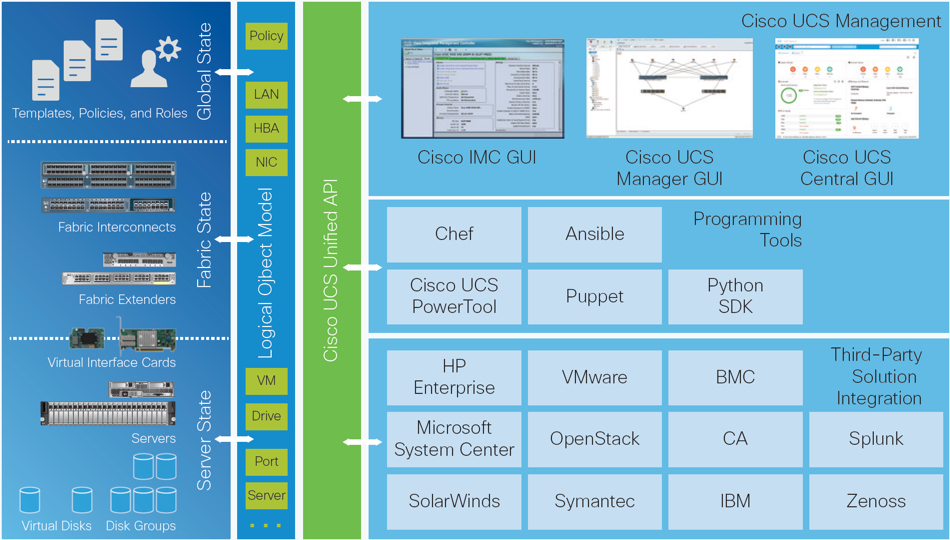
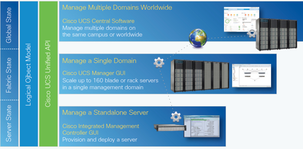

# Let's Take a Look Under the Hood at the UCS XML API

Cisco UCS is an Integrated Compute Infrastructure that has supported an XML API since its introduction. UCS Manager, IMC, and UCS Central are the services that provide the XML API endpoint along with a graphical interface and a command line. The UCS components, both physical and logical, are represented as XML objects in a hierarchical Object Model format and can be manipulated via the XML API.

All UCS components are objects that are described in an XML schema that defines the objects, their attributes and associated values. Because a UCS component must be part of the **Object Model** to be part of the UCS system, all components of UCS are always available via the XML API.

## Objectives

Completion time: 20 minutes

  - UCS Object Model Refresher
  - UCS XML API
  - UCS XML API via Postman
    - Login
    - Query
    - Configure
    - Logout

## Prerequisites

Basic knowledge of UCS Compute would be useful, but not necessary. Other than that a desire to learn is all you need to bring with you.

## UCS Unified API

Cisco UCS Unified API provides unified, embedded management of all software and hardware components of the Cisco Unified Computing System™ (Cisco UCS) and Cisco HyperFlex™ Systems across multiple chassis and rack servers, and thousands of virtual machines. It supports all Cisco UCS product models, including Cisco UCS B-Series Blade Servers and C-Series Rack Servers, Cisco UCS Mini, and Cisco HyperFlex hyperconverged infrastructure, as well as the associated storage resources and networks. Cisco UCS Unified API is embedded on a pair of Cisco Fabric Interconnects as UCS Manager, on Stand-Alone UCS C-Series Servers as the Integrated Management Controller (IMC), and on UCS Central. The Unified API allows server provisioning, device discovery, inventory, configuration, diagnostics, monitoring, fault detection, auditing, and statistics collection.

The Cisco UCS API Object Model is Unified Across Components:

    

  <!--  -->

The Cisco UCS API provides comprehensive access to all Cisco UCS Manager functions. The unified API provides Cisco UCS system visibility to higher-level systems management tools from independent software vendors (ISVs) such as VMware, Microsoft, and Splunk as well as tools from BMC, CA, HP, IBM, and others. ISVs and in-house developers can use the API to enhance the value of the Cisco UCS platform according to their unique requirements. Cisco UCS PowerTool for UCS Manager and the Python Software Development Kit (SDK) help automate and manage configurations in Cisco UCS Manager.

The Cisco UCS Unified API Delivers Scalability Across the Data Center:

    

  <!--  -->

# Step 1

### UCS Object Model Refresher

This discussion is based on UCS Manager, however the Object Model structure and rules apply to IMC and UCS Central.

All the physical and logical components that comprise Cisco UCS are represented in a hierarchical management information model (MIM), also referred to as the Management Information tree (MIT). Each node in the tree represents a managed object (MO) or group of objects that contains its administrative state and its operational state.

The hierarchical structure starts at the top (sys) and contains parent and child nodes. Each node in this tree is a managed object and each object in Cisco UCS has a unique distinguished name (DN) that describes the object and its place in the tree. Managed objects are abstractions of the Cisco UCS resources, such as fabric interconnects, chassis, blades, and rack-mounted servers.

Certain managed objects are not created by users, but are automatically created by the Cisco UCS, for example, power supply objects and fan objects. By invoking the API, you are reading and writing objects to the MIM.

The information model is centrally stored and managed by the data management engine (DME), a user-level process running on the fabric interconnects. When a user initiates an administrative change to a Cisco UCS component (for example, applying a service profile to a server), the DME first applies that change to the information model, and then applies the change to the actual managed endpoint. This approach is called a model-driven framework.

### UCS XML API

When making a UCS XML API call the request is done over HTTP/S with the requested operation encoded as an XML document contained in the body of an HTTP **POST** request.  The UCS XML API response is encoded as an XML document the HTTP response body.

Features of the UCS XML API
  - HTTP/S supported
  - Role Based Authentication the same as the GUI and CLI
  - Built in Object Browser
  - Single API Endpoint
  - Highly Available by default for UCS Manager

The UCS XML API utilizes a single endpoint for API calls `http://<ucs-manager-name-or-ip>/nuova`. Most UCS XML API calls (~99.999%) are HTTP **POST** requests, there are a few UCS XML API calls the utilize HTTP **GET**, *typically any UCS XML API that results in a file download*, for example, SEL log retrieval and tech support log retrievals. The exercises in this lab only cover the HTTP **POST** calls.

UCS XML API is **NOT** a REST API, the HTTP response codes returned after a UCS XML API request are only related to the HTTP request/response cycle and have no relationship to the requested XML API operation.

  - The UCS Object Class is similar to a REST resource group. For example the UCS ***computeBlade*** class represents all the servers in a UCS Domain.

  - The UCS Object Dn (distinguished name) is similar to a REST resource entity. For example the UCS Dn `sys/chassis-1/blade-1` represents a single server of class ***computeBlade*** in the UCS Domain.

UCS XML API enables the retrieval and manipulation of UCS Manager managed objects. UCS Manager API interaction can be categorized into several distinct sections.
  - Sessions
  - Methods
  - Queries and Filters
  - Configurations and Transactions
  - Event Subscription

The UCS XML API has been available from the initial UCS product offering. Since that time several tools and utilities have been built to make the UCS XML API easier to utilize. Two such tools are UCS PowerTool, a suite of PowerShell modules and UCS Python SDK, both tools allow you to manage UCS Manager, Cisco IMC and UCS Central.

UCS PowerTool and UCS Python SDKs are recommended as the methods to interact programmatically with UCS systems. However, knowing the underlaying XML API can help with troubleshooting and debugging. Both tools provide methods for exposing the underlying XML API requests and responses.

Next Step: Use the UCS XML API via Postman.
