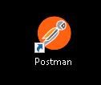
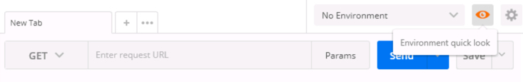
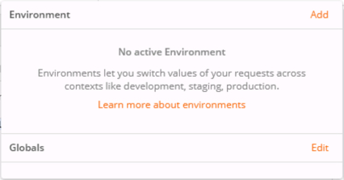
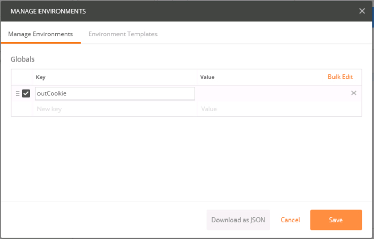
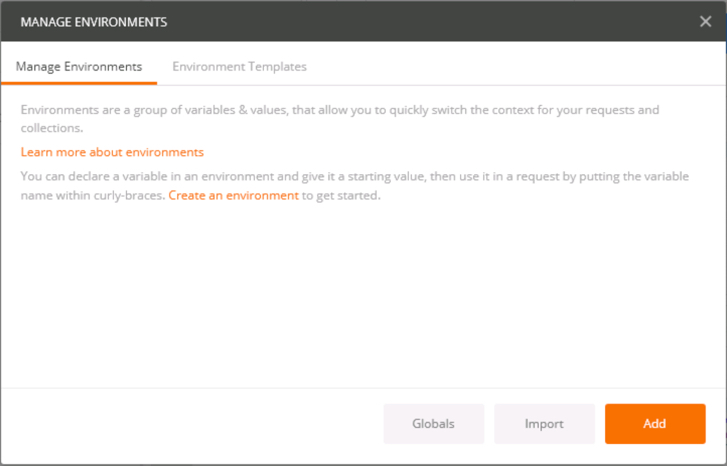
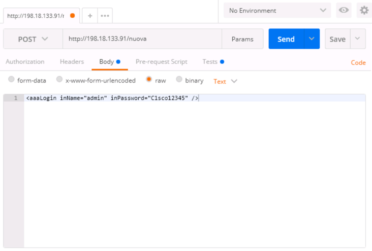
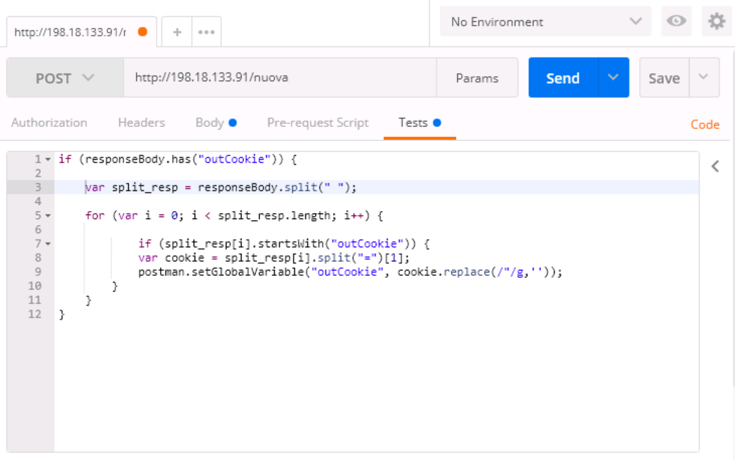
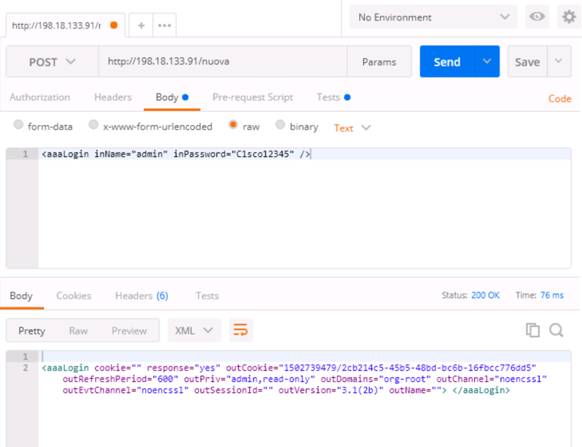
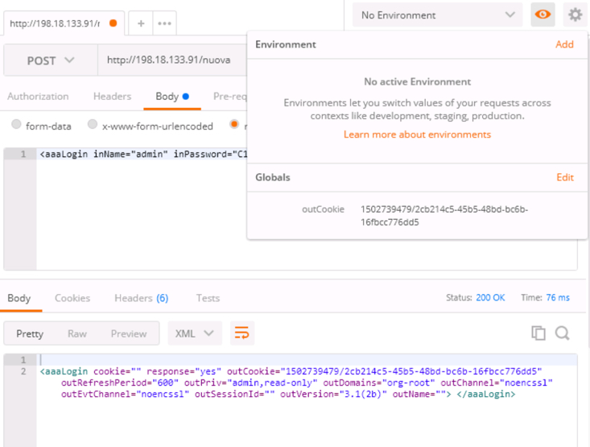

# Let's Take a Look Under the Hood at the UCS XML API

# Step 2

Let's start with the UCS XML API by establishing a **session**, or better know as logging in.

When a session is established with the UCS API endpoint an authentication token is returned, in the UCS XML API the authentication token is called a **cookie**.

The **cookie** is required for all query and configuration operations.

You will utilize Postman for all the operations in this lab. Additionally you will utilize some features of Postman to keep track of your cookie.

Postman has a mechanism for running post HTTP request "Tests"

This feature can be used in conjunction with Postman Global Variables to extract the authentication cookie and save it to a Postman global variable.

### Exercise Setup

In this lab the UCS XML API calls will be made against a UCS Platform Emulator, you can open the emulator to verify/view the XML API interactions.

To launch **UCS Manager** ***double-click*** the UCS Manager icon on the desktop.

  - **Username** - `admin`
  - **Password** - `C1sco12345`

  UCS Manager Desktop Shortcut:

    <br/><br/>

    <br/><br/>-->

### Exercise 1

Login to UCS Manager and use Postman to extract your authentication cookie and save it to a global variable.

  1. To launch **Postman** ***double-click*** the Postman icon on the desktop.

  Postman Desktop Shortcut:

    <br/><br/>

    <br/><br/>-->

  2. Create a Postman Global Variable

    - ***Click*** the "eye" icon on the right hand side of the screen
    - ***Click*** "Add" to the right of **Globals**
    - ***Enter*** the variable name **outCookie**
    - ***Click*** the "Save" button
    - ***Click*** the "X" in the upper right-hand corner of the "MANAGE ENVIRONMENTS"

    <br/><br/>

    <br/><br/>-->

    <br/><br/>

    <br/><br/>-->

    <br/><br/>

    <br/><br/>-->

    <br/><br/>

    <br/><br/>-->

  3. Establish a session with the UCS Manager

    - ***Enter*** the Url `http://198.18.133.91/nuova` as the request destination
    - ***Click*** the HTTP Method drop-down and select **POST**
    - ***Click*** the "Body" tab
    - ***Select*** the "raw" radio button
    - ***Enter*** the UCS XML API "aaaLogin" method
      ```
      <aaaLogin inName="admin" inPassword="C1sco12345" />
      ```
    - ***Click*** the "Tests" tab
    - ***Enter*** the code below. The code tests the response for the presence of a UCS authentication token, a cookie and if found sets the Postman Global variable, "outCookie" to the returned "outCookie"
    ```JavaScript
    if (responseBody.has("outCookie")) {

      var split_resp = responseBody.split(" ");

      for (var i = 0; i < split_resp.length; i++) {

              if (split_resp[i].startsWith("outCookie")) {
              var cookie = split_resp[i].split("=")[1];
              postman.setGlobalVariable("outCookie", cookie.replace(/"/g,''));
          }
      }
    }
    ```
    - ***Click*** the "Send" button
    - ***View*** the response in the lower pane
    - ***Click*** the "eye" icon to vie the environment and verify that the Postman Global variable "outCookie" was populated with the "outCookie" that was returned in the UCS XML API response.

    <br/><br/>

    <br/><br/>-->

    <br/><br/>

    <br/><br/>-->

    <br/><br/>

    <br/><br/>-->

    <br/><br/>

    <br/><br/>-->

Next Step: Use the UCS XML API via Postman to Query and Configure UCS Manager.
