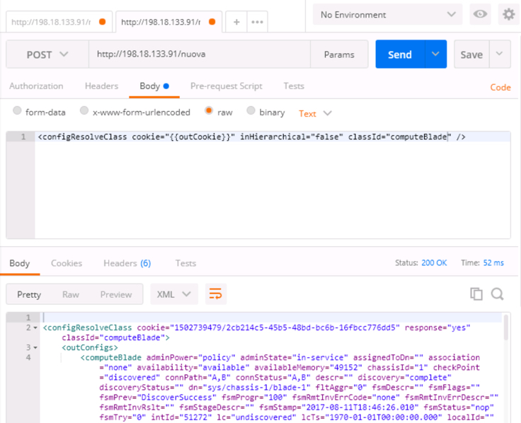
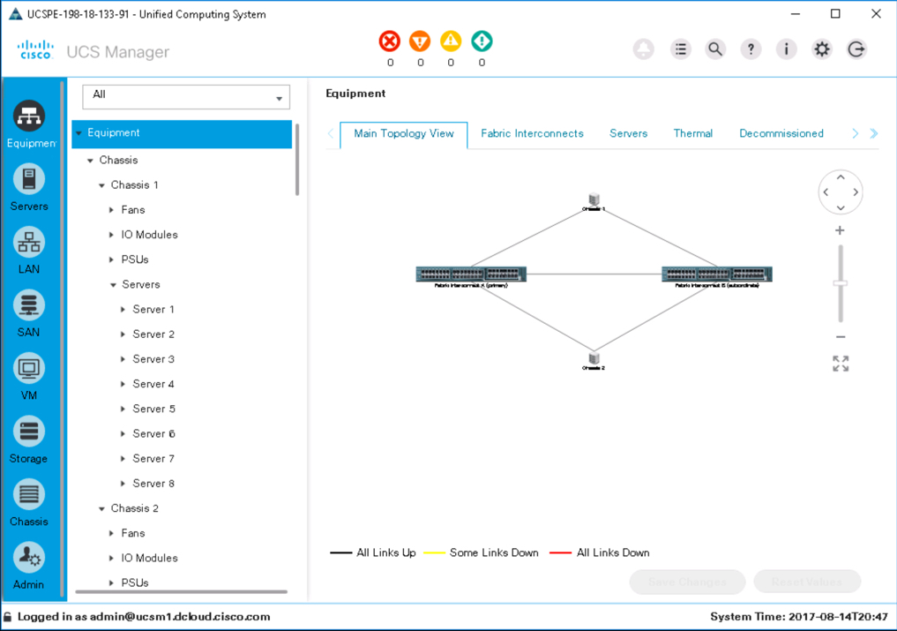
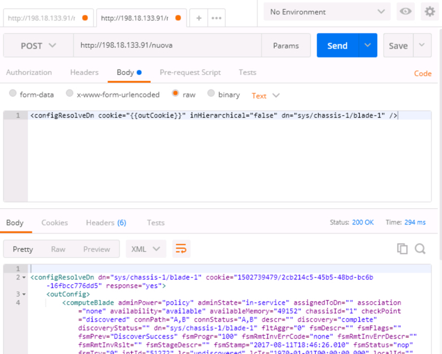
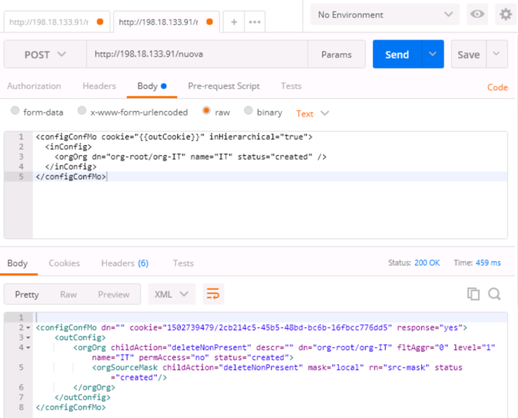
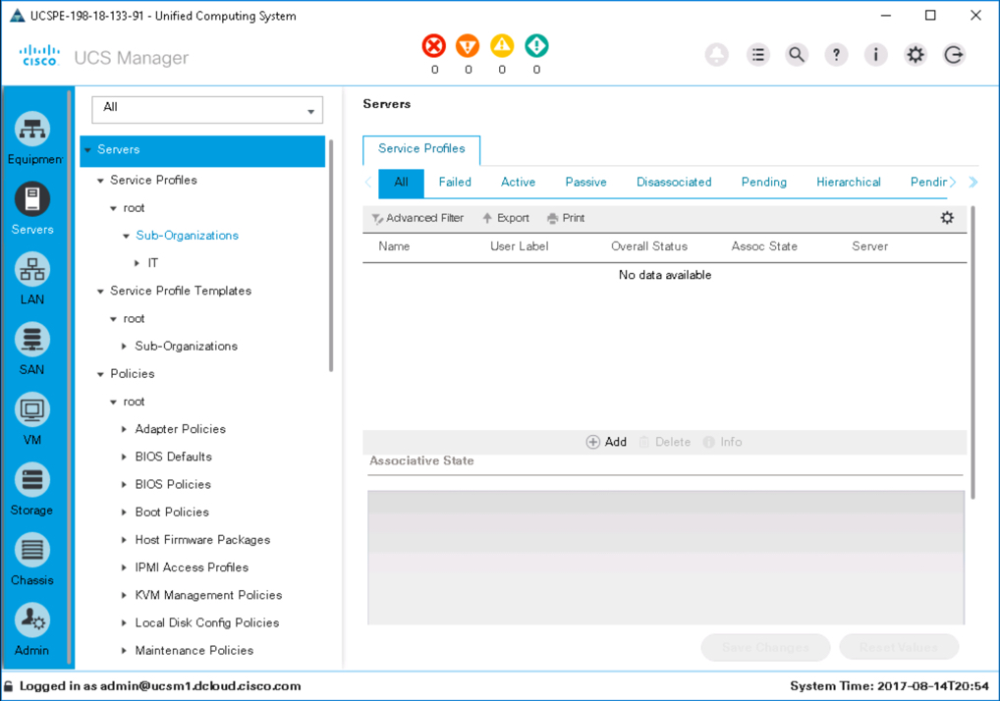
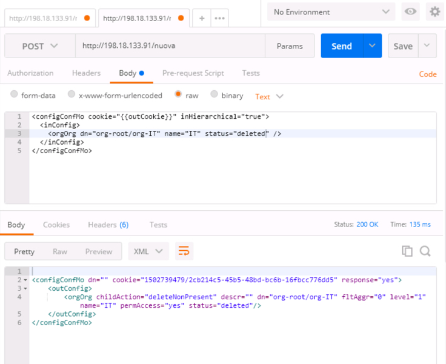
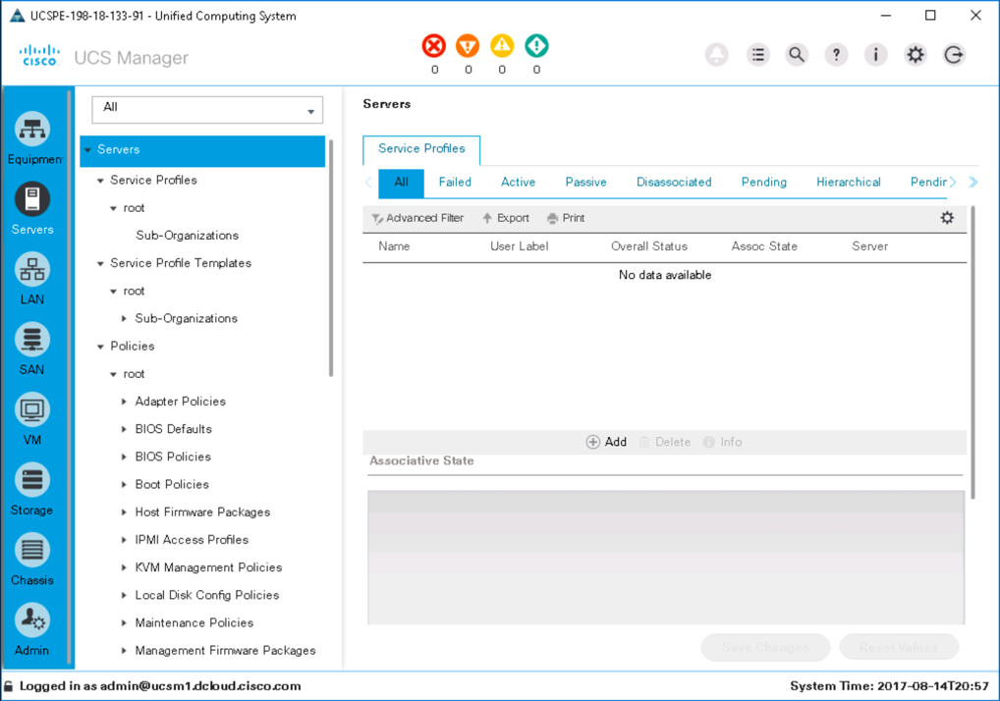
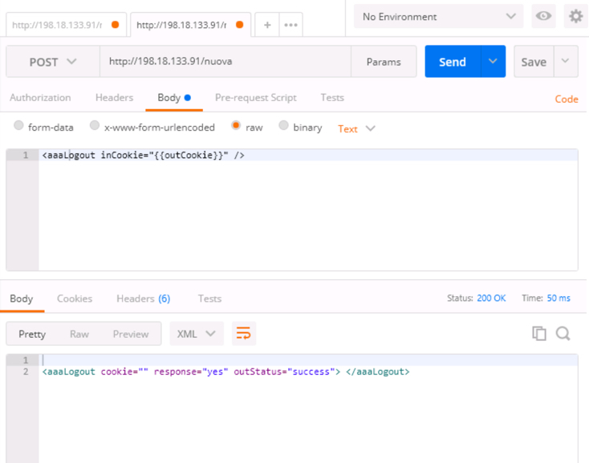

# Let's Take a Look Under the Hood at the UCS XML API

# Step 3

### Exercise 2

Now that a UCS session has been established you can query and configure UCS Objects.

  1. Query the UCS Manager for all the servers of Class ***computeBlade***

    - ***Click*** the "+" to create a new tab.
    - ***Enter*** the Url `http://198.18.133.91/nuova` as the request destination
    - ***Click*** the HTTP Method drop-down and select **POST**
    - ***Click*** the "Body" tab
    - ***Select*** the "raw" radio button
    - ***Enter*** the UCS XML API query method `configResolveClass` code below to retrieve all the UCS objects that belong to the Class ***computeBlade***. Notice the notation for "outCookie", the double braces "{{}}wrapping "outCookie" indicate to Postman that the Global variable "outCookie" should be utilized.
    ```
    <configResolveClass cookie="{{outCookie}}" inHierarchical="false" classId="computeBlade" />
    ```
    - ***Click*** the "Send" button
    - ***View*** the response in the lower pane

    <br/><br/>

    <!--<br/><br/>-->

    The response is in an XML format, take a moment to look at the response and see that there is an XML object for each ***computeBlade*** in the UCS, there should be 16 in total

    View the equipment section in UCS Manager and notice that there are 8 UCS ***computeBlades*** in each chassis, for a total of 16 ***computeBlades***

    <br/><br/>

    <!--<br/><br/>-->

  2. Query the UCS Manager for a specific ***computeBlade*** by utilizing the Dn (distiguished name) of the UCS object.

    - ***Enter*** the UCS XML API query method `configResolveDn` code below to retrieve a since UCS object by Dn. Utilizing the same tab as before change the request "Body".
    ```
    <configResolveDn cookie="{{outCookie}}" inHierarchical="false" dn="sys/chassis-1/blade-1" />
    ```
    - ***Click*** the "Send" button
    - ***View*** the response in the lower pane

    The response should have only a single ***computeBlade*** object.

    <br/><br/>

    <!--<br/><br/>-->

### Exercise 3

Use the UCS XML API to create and delete and Organization in UCS Manager

  1. Send the UCS XML API to **create** a UCS Organization named "IT", the UCS object class for an Organization is ***orgOrg***

  - ***Enter*** the UCS XML API configuration method `configConfMo` code below to create a UCS organization. Utilizing the same tab as the previous exercise change the request "Body".
  ```
  <configConfMo cookie="{{outCookie}}" inHierarchical="true">
      <inConfig>
        <orgOrg dn="org-root/org-IT" name="IT" status="created" />
      </inConfig>
  </configConfMo>
  ```
  - ***Click*** the "Send" button
  - ***View*** the response in the lower pane
  - ***View*** the results in UCS Manager
    - ***Click*** the "Servers" icon in UCS Manager
    - ***Click*** the twistie next to "Sub-Organizations" under the "root" Organization to verify that there is a new "IT" Organization.

    <br/><br/>

    <!--<br/><br/>-->

    <br/><br/>

    <!--<br/><br/>-->

  2. Send the UCS XML API to **delete** a UCS Organization named "IT".

    - ***Enter*** the UCS XML API configuration method `configConfMo` code below to delete a UCS organization. Utilizing the same tab as the previous exercise change the request "Body".
      - Only the value of "status" needs to be changed
    ```
    <configConfMo cookie="{{outCookie}}" inHierarchical="true">
        <inConfig>
          <orgOrg dn="org-root/org-IT" name="IT" status="deleted" />
        </inConfig>
    </configConfMo>
    ```
    - ***Click*** the "Send" button
    - ***View*** the response in the lower pane
    - ***View*** the results in UCS Manager
      - ***Click*** the "Servers" icon in UCS Manager
      - ***Click*** the twistie next to "Sub-Organizations" under the "root" Organization to verify that the "IT" Organization has been removed.

      <br/><br/>

      <!--<br/><br/>-->

      <br/><br/>

      <!--<br/><br/>-->

### Exercise 3

Use UCS the XML API to end your session, also known as logging out.

  1. Send the UCS XML API to end you session

  - ***Enter*** the UCS XML API session method `aaaLogout` code below to end you session. Utilizing the same tab as the previous exercise change the request "Body".
  ```
  <aaalogout inCookie"{{outCookie}}" />
  ```
  - ***Click*** the "Send" button
  - ***View*** the response in the lower pane

  You have ended your UCS XML API session.

  <br/><br/>

  <!--<br/><br/>-->

Congratulations! You've completed the lab *Let's Take a Look Under the Hood at the UCS XML API*.
